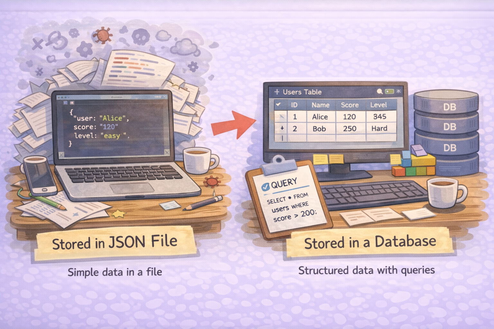
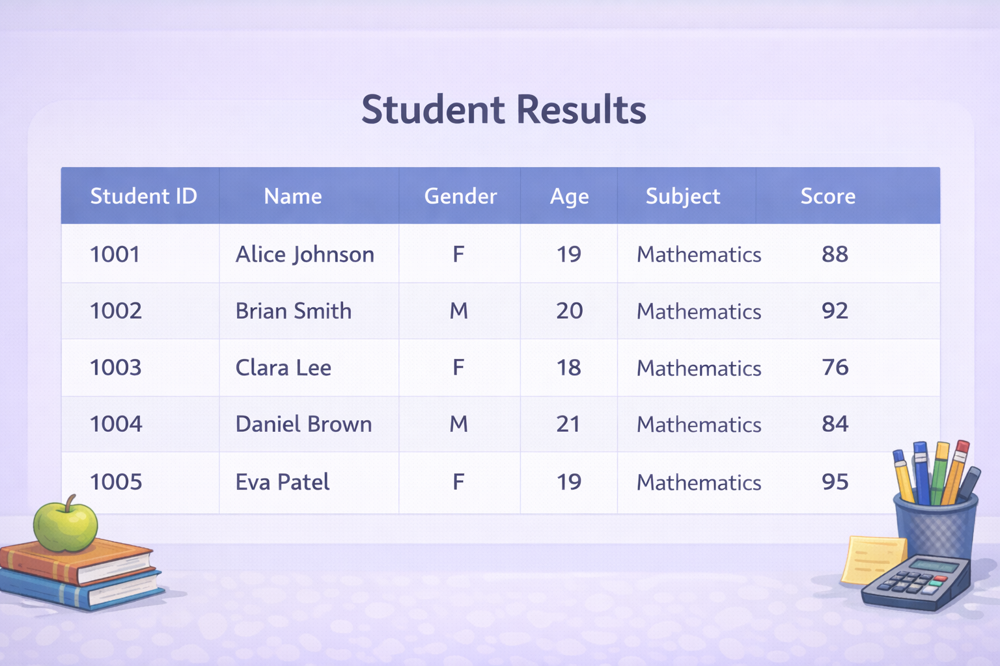
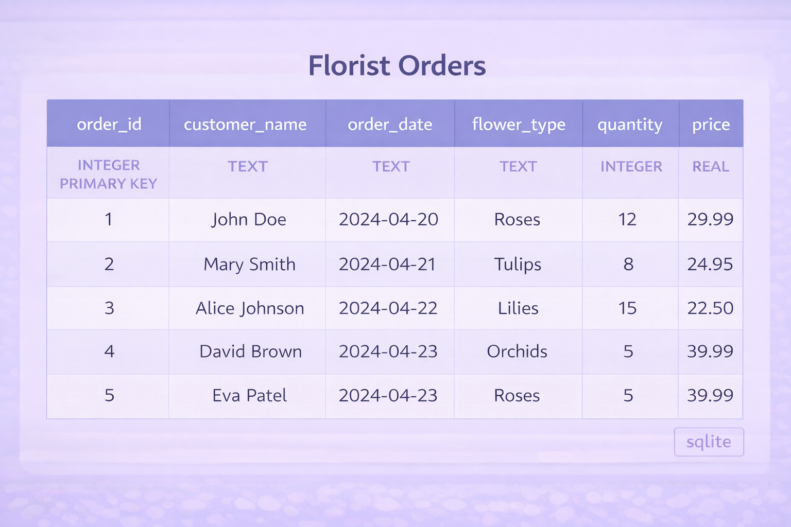
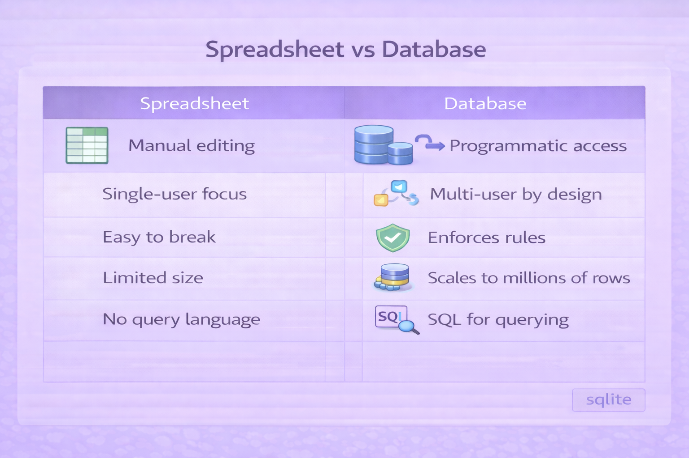
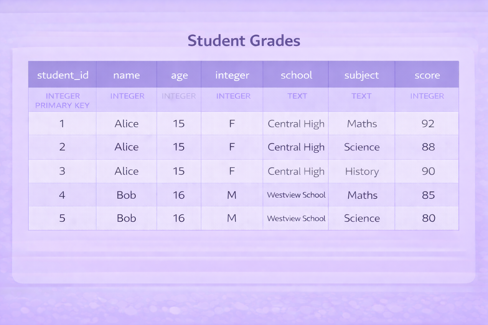
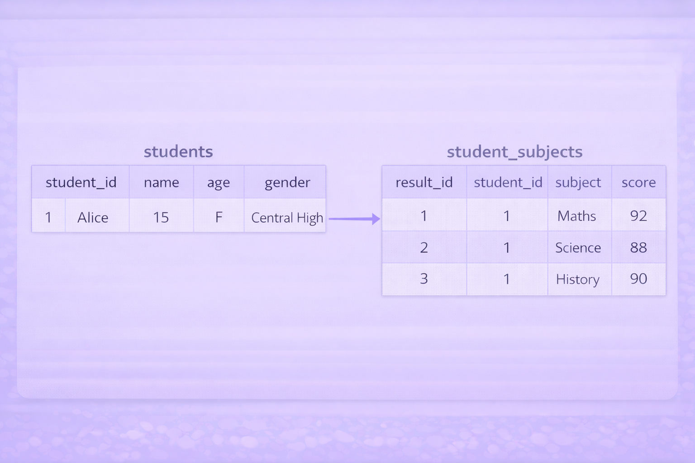
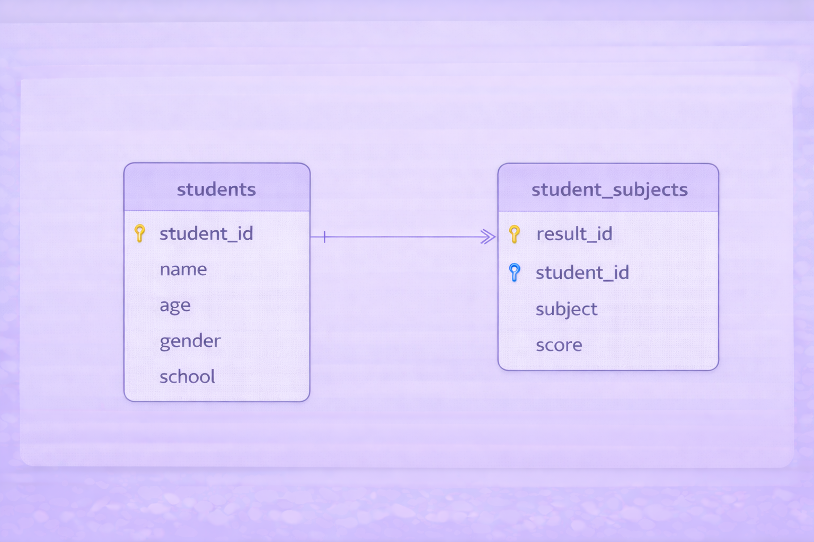
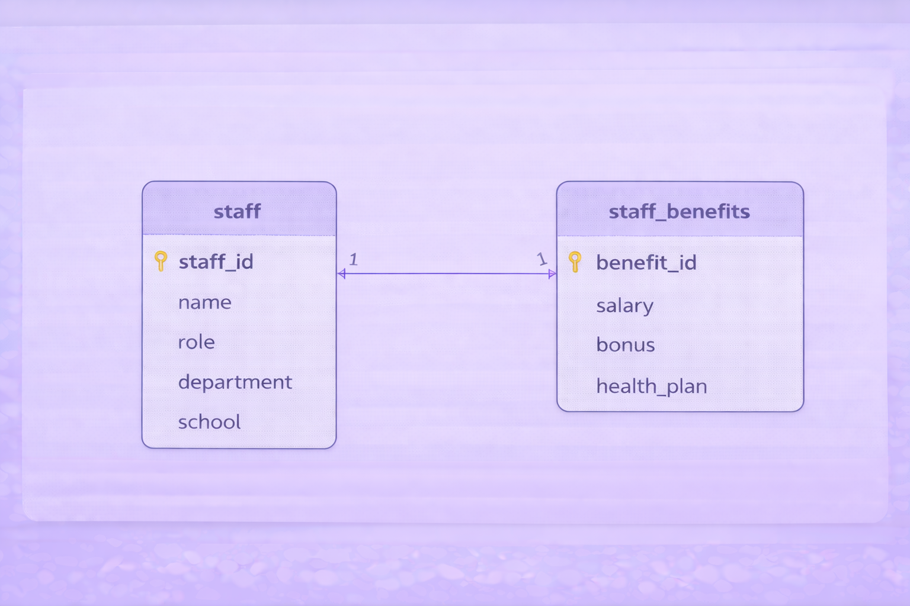
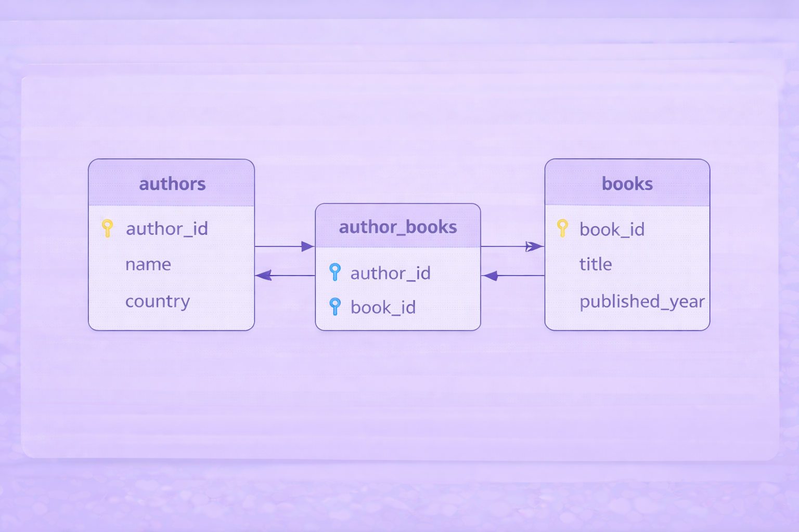

# Day 6

### Data and SQL

--- 

information, especially facts or numbers, collected to be examined and considered and used to help decision-making, or information in an electronic form that can be stored and used by a computer

---

---

---

---

A database is a <b>system for storing and managing structured data</b> so it can be: 

<ul>
<li>Queried efficiently</li>
<li>Updated safely</li>
</ul>

---

---

- Excel: 1,048,576 rows
- SQLite: 18,446,744,073,709,551,616 rows

---

---

---

--- 

--- 

--- 

