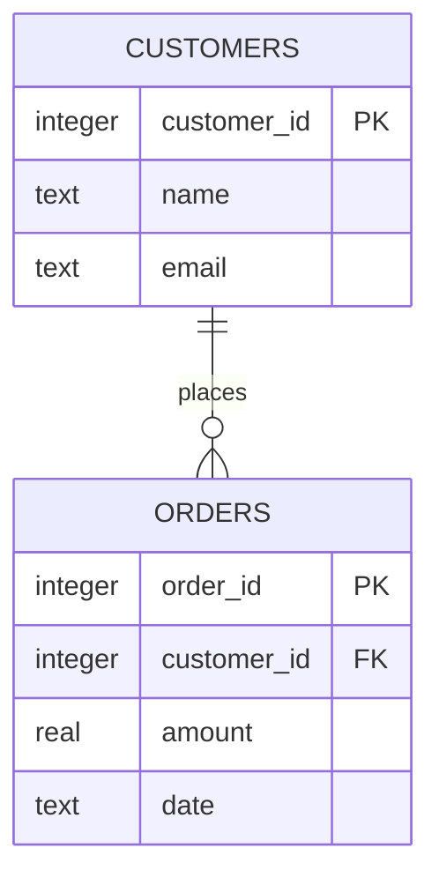

# 📊 Project Brief: VMO2 Data Workflow Application

## 🎯 Objective
In your teams, build a Python application that replicates or improves a real process you recognise from your day-to-day work.

The goal is to apply core Python skills in a practical, realistic scenario.

---

## 🔧 What Your Project Must Include

### 1. Data Input
- Load one or more datasets using Python  
- Supported formats:
  - CSV
  - JSON
  - XML
  - Excel
  - Other structured data sources

---

### 2. Processing
- Transform and manipulate the data using core Python concepts:
  - Functions
  - Loops
  - Conditionals
- Examples:
  - Filtering records
  - Aggregating values
  - Cleaning data

---

---

### 3. Entity Relationship Diagram (ERD)
- Design and include an ERD that represents your database schema
- The ERD should show:
  - Tables
  - Fields
  - Primary keys
  - Relationships between tables

#### Example ERD (Conceptual)

---

### 4. Database Requirement (SQLite)
- Implement a SQLite database to store and manage your data
- Your project must:
  - Create at least one database
  - Define structured tables

---

### 5. API Integration
- Retrieve data from an external API
- Integrate API data into your workflow
- Example use cases:
  - Enriching datasets with live data
  - Validating or augmenting records

---

### 6. Outcome
- Produce a final output such as:
  - A processed dataset
  - A report
  - A summary or insight
  - Stored results in the database

---

## 🔄 What You’re Building

A simple end-to-end data workflow:

Input → Process → Store (SQLite) → Enrich (API optional) → Output

---

## 👥 Team Approach

Work collaboratively based on confidence levels:

- Pair Programming
- Driver / Nevigator

---

## ✅ Outcome (End of Day 2)

Your team should deliver:

- A working Python script or notebook
- A SQLite database with structured tables
- An ERD diagram of your database
- A short explanation covering:
  - The process you replicated
  - The data and API used
  - The output produced

---

## 👩🏼‍💻 Outcome (Day 3)

Your team should deliver a presentation, highlighting:

- The application they'be built (with demonstration)
- The ERD
- Any important classes
- Challenges
- What you've learnt

Presentations should last between 3 to 5 minutes.

---

## 💡 Key Point

Focus on something realistic and familiar, not overly complex.

The goal is to demonstrate your ability to apply core Python concepts to a real-world workflow.

