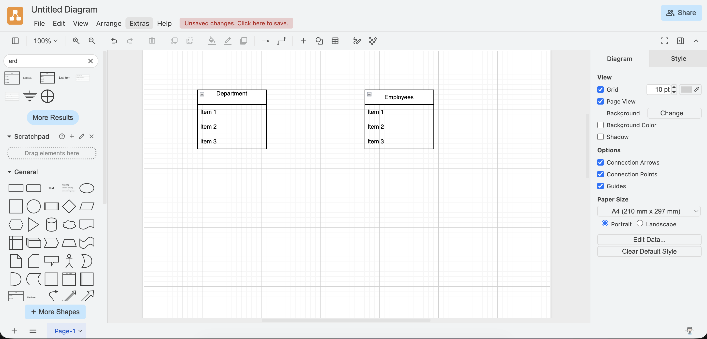
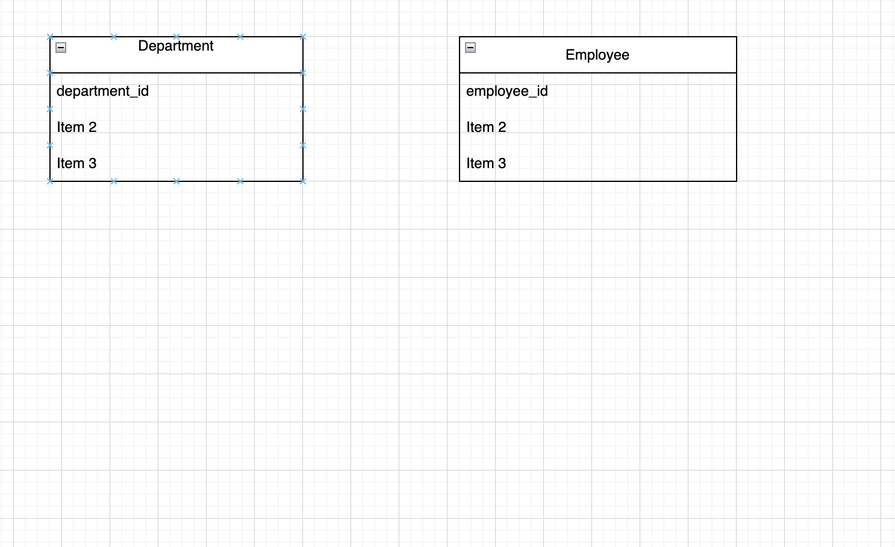
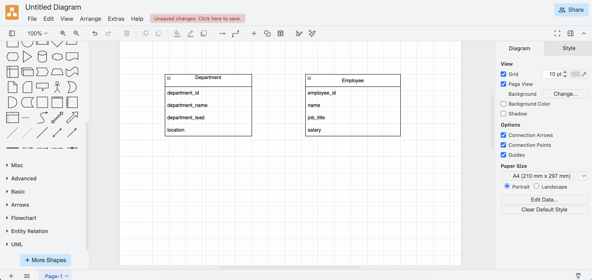
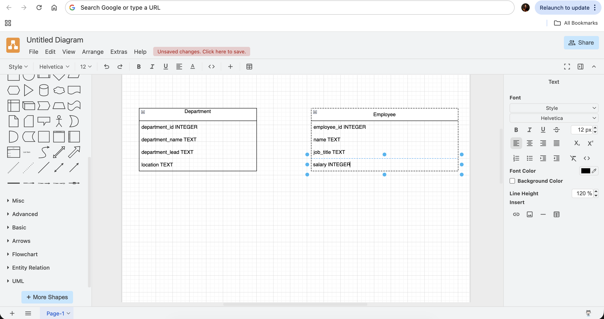
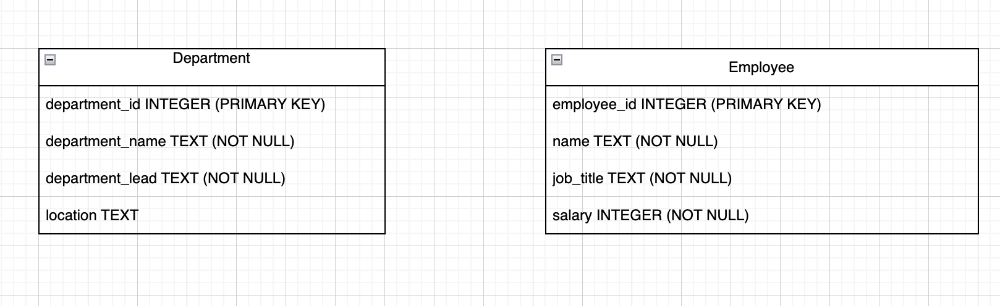
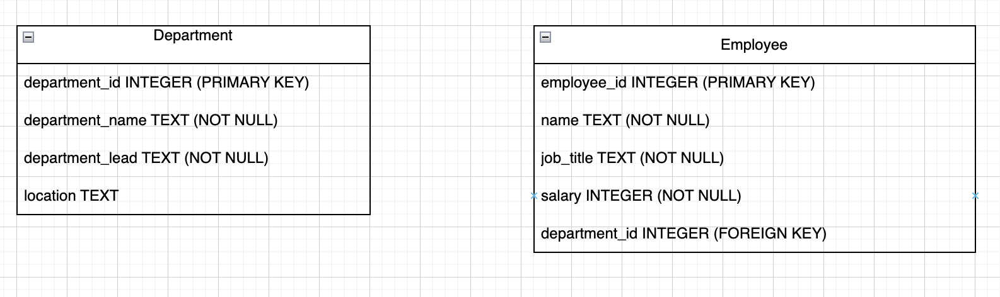
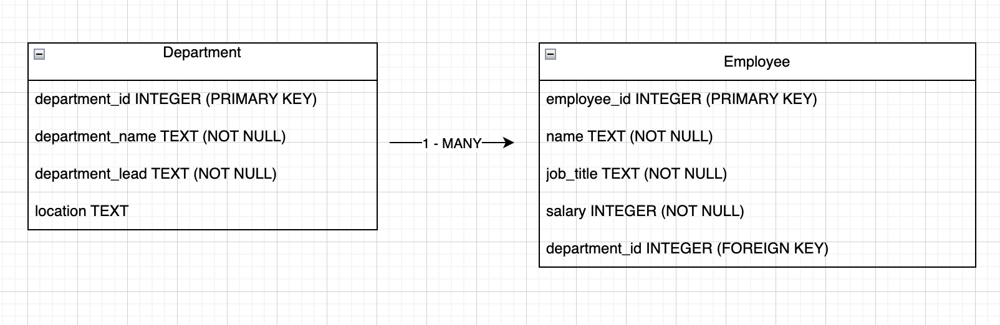

# Advanced Python — Day 7


# Pre-Training

- Load Slidee Day 7


# Training

`SLIDE 1`

Good morning everyone. I hope you're all doing well. Today is the final day we're going to introduce a wide set of new techniques to interact with code. 

Yesterday we spend the day querying a DB I created, getting different pieces of information out. 

Today we're going to shift towards creating an interacting with a DB in Python. 

We've seen that we're able to query a DB using SQL and it's an import skill to continue to develop. 

A lot of the time though we ought to try and limit direct communication with a DB. 

Instead we write code ourselves, in this case with Python to interact with that database and programmatically call on the DB to reveal certain pieces of data.

## Our Session

We're going to move past looking at student data and do something more closey related to VMO2. 

I want to create a DB with two tables.

1. The first linked to our customers
2. The second, containing information about the different packages available. 

Both tables should independantly have some value. 

We ought to be able to pull customer data, to see names, contact details. Additionally, I also want to be able to independantly query our table about the packages, to pull information about the different offerings we have.

Finally, it's important that we're also able to pull a customers data and see the package details that they have. 

This presents our first obstacle. 

It's not advisable to go straight into GitHub Codespaces and start writing code before we've thought about our data and the relationship our data has. 

I want to get you thinking about this independantly first and pose a different set of data.

Before we move onto customers, let's think about some alternative data. 

Let's think about a **Department table** and an **Employees table**, both pieces of data can live seperately but also there's a clear relationship between to two. 

I'm going to show you a program which can help us build Entity Relationship Diagrams which will help us visualise our data, before we go diving head-first into writing code. 


https://app.diagrams.net/?src=about

Diagrams.Net is a tool where we can model different data relationships. 

It's more than valid to do this using pen and paper, it's actually quite common but, I wouldn't have the pleasure of being able to show you the ERD we'll create. 

So we've got a base already.

Two tables

1. Department
2. Employees

To the top left of my screen you'll see a place where I can search for templates.

If I type ERD we'll see some generic templates we can use and I'll just pick any of these for the time being. 

I'll do that twice and then name one of them **department** and the other **employees**



The next thing to do is decide what the primary key is.

To remind you, the primary key is that unique piece of data which appears on every row. 

Without it, we'd never be able to isolate any one entry.

It's fairly standard for the primary key to be the table name and underscore id.

So:
- `department_id`
- `employee_id`




I've got a series of questions for myself.

What information should be keep for each department. 

I want to say a:

- department name
- department lead
- location

Then for our employees, what information is pertinet to store

For now, let's say:

- name
- job title
- salary



The next thing for us is to think about what datatypes should be associated with each column. 

Let's remind ourselves of the different datatypes in SQLite because they differ from Python

`SLIDE`

We have:
- NULL, for no data
- INTEGER, for whole numbers
- REAL, instead of floats
- TEXT, instead of strings
- BLOBS, which we're not going to focus on today
- We also have Booleans but they're represented as Integers
  - 0 for false
  - 1 for true

I'm going to tell you that our primary keys will be integers

**ASK**

What about:
- department name --> TEXT
- department lead --> TEXT
- location --> TEXT

That's fairly simple

How about:
- name --> TEXT
- job_title --> TEXT
- salary --> INTEGER or maybe a REAL


Let's update the graph to show this information



A couple more things to think about

We don't always have to have data entered on specific fields 

**ASK**

Do you think there's any fields we could get away with having not having a value present?

**ANSWER**

In a perfect world, we'll always have polished data but what'll I'll say for now is let's say we don't have to have a value for the location on the department table

We represent that by saying **NOT NULL**, i.e. it can't not have a value.

Whilst I make that change I'll also add in tags for the PRIMARY KEYS.



One last thing we need to think about.

It's the relationship between the two tables. 

It's going to be a **1 to many** relationship.

1 entry on one table is going to be able to link to many entries on the other table. 

**ASK**

Which table do we think is going to have many entries associated with the other?

**ANSWER**

Many employees will have information related to a signel department entry. 

To do that we need to add another column on the **employee table** which will store the primary key value of the department they're in.

That's going to be a Foreign key, information which relates to a different, or foreign table.




It's common to add arrows to our ERD to represent this relationship more clearly. 




Now we have a complete ERD, a fitting visual representation of fore-planning and a methodical approach. 

We can see what the different data is going to be, the types of data, if we need a value and most importantly, the relationship between the data. 

### CHALLENGE

I want you to have a good planning a simple ERD yourselves. 

You can either use the software I'm on, or a pen and paper if you have one handy. 

https://app.diagrams.net/?src=about

I want you to create an ERD, with information about:
- primary keys
- columns
- data types
- NOT NULL entries
- One Foreign Key

On two tables. 

That can either be for a sports team and their players.

So maybe:
- A football club and the players
- A F1 team and their drivers
- A cycling team etc..

Or if you don't necessarily follow a sport maybe a band
- One table for band information
- A second table for the members of the band

Both would be 1 to many relationships and will carry different pieces of data for you to reflect on. 

I'll give you 10 or 15 minutes to do so before we get back to actually doing this programatically. 

### End of Challenge


I've taken the liberty to create an ERD for our customer and package information. 

`SLIDE`

Just to reiterate, don't start create tables on CodeSpace before you've done the ERD and reflected on the data. It's must harder to widen the range of data in the DB once it's live and in use, not impossible but it's better to do the work before. 


Let's get into Codespaces then! 

We're going to do something brand new and exciting now.

We're going to have lots of different files. 

Our project is going to be more complex and having one file isn't practical. 

Because we're also going to creating .sql files, it also isn't possible. 

I'm going to create two folders.
1. db -> which will have functionality to set up and create our db
2. classes -> where some of our classes will live

*CREATE db AND classes FOLDER*

Then inside each folder I'm going to need some files. 

We'll need to define our SQL schema and I'm also going to give our DB some initial data. 

This is called seeding. 

We do this through the process of **seeding**.

It's normally done in development of applications so we can use test data before a program goes live. 

*INSIDE DB CREATE schema.sql AND seed.sql*

Then I also need to add one more file inside the DB folder.

We have to have a python file, which we can trigger which will handle that SQL connection and trigger our initial sql scripts. 

*INSIDE DB CREATE db.py FILE*

```
project/
│
├── main.py
│
├── db/
│   ├── db.py
│   ├── schema.sql
│   └── seed.sql
│
└── classes/
    ├── package.py
    └── customer.py
```


A little bit more simply, I'm going to create two files inside our **classes** folder which will seperate out of classes into seperate folders for readability. 

*INSIDE CLASSES CREATE package.py AND customer.py*

If we don't already, we'll also keep our trust *main.py* at the root of our project as well. 


### The Code

When working on a project with a database, we've already said, we should begin with sketching out an ERD.

Once we've done that we should create the db in our program, before we start getting to hands on in Python.

The reason being is our Python code is going to have to latch onto our DB, so the database should exist beforehand. 

Let's start in our **schema.sql**

In our ERD we mapped out what our two tables should look like.

We need to write some SQL code to create the table. 

**schema.sql**
```sql
CREATE TABLE packages (
    package_id, 
    package_name,
    price, 
    contract_length
);
```

This is another SQL query, this time to create a table. 

We still need to semi colon on the end. 

So we have our key word **CREATE TABLE** followed by the table name and then our column headers.

It intentially reflects our ERD quite nicely. 

We can also pass in other pieces of information about the datatypes.

**schema.sql**
```sql
CREATE TABLE packages (
    package_id INTEGER,
    package_name TEXT,
    price REAL,
    contract_length INTEGER
);
```

Let's pass in some more information, I need to tell the table, what the primary key is. 

**schema.sql**
```sql
CREATE TABLE packages (
    package_id INTEGER PRIMARY KEY,
    package_name TEXT,
    price REAL,
    contract_length INTEGER
);
```

Finally, which values we must have. 

**schema.sql**
```sql
CREATE TABLE packages (
    package_id INTEGER PRIMARY KEY NOT NULL,
    package_name TEXT NOT NULL,
    price REAL NOT NULL,
    contract_length INTEGER NOT NULL
);
```

We're nearly there. 

We're going to call this file to execute and create the tables. 

We only real want to do this once. Once the table is up, we don't want to try and recreate this. 

This could overwrite our data or create duplicates. Both would be problematic. 

**schema.sql**
```sql
CREATE TABLE IF NOT EXISTS packages (
    package_id INTEGER PRIMARY KEY NOT NULL,
    package_name TEXT NOT NULL,
    price REAL NOT NULL,
    contract_length INTEGER NOT NULL
);
```

### Challenge

I'm going to give you 5 minutes, I want you to try and define the schema, borrowing this pattern to create the customer table. 

Choose the datatypes yourself and for the column names I'm going to continue using snake case. 

SQL doesn't actually have an opinion on this, but we should be consistent. 

I'm also going to require all data entries.

I'll write this out as well if helpful. Ignore the foreign key for the time being too, we'll do this together. 

#### Solution
**schema.sql**
```sql
CREATE TABLE IF NOT EXISTS packages (
    package_id INTEGER PRIMARY KEY NOT NULL,
    package_name TEXT NOT NULL,
    price REAL NOT NULL,
    contract_length INTEGER NOT NULL
);

CREATE TABLE IF NOT EXISTS customers (
    customer_id INTEGER PRIMARY KEY NOT NULL,
    first_name TEXT NOT NULL,
    last_name TEXT NOT NULL,
    email TEXT,
    phone TEXT
);
```

To add a foreign key, we first add the column information as normal. 

**schema.sql**
```sql
CREATE TABLE IF NOT EXISTS packages (
    package_id INTEGER PRIMARY KEY NOT NULL,
    package_name TEXT NOT NULL,
    price REAL NOT NULL,
    contract_length INTEGER NOT NULL
);

CREATE TABLE IF NOT EXISTS customers (
    customer_id INTEGER PRIMARY KEY NOT NULL,
    first_name TEXT NOT NULL,
    last_name TEXT NOT NULL,
    email TEXT,
    phone TEXT,
    package_id INTEGER NOT NULL
);
```

Then we need to tell the table, what column holds the foreign key value. 

The foreign key is associated with the primary key from another table. All this information we need to write. 

**schema.sql**
```sql
CREATE TABLE IF NOT EXISTS packages (
    package_id INTEGER PRIMARY KEY NOT NULL,
    package_name TEXT NOT NULL,
    price REAL NOT NULL,
    contract_length INTEGER NOT NULL
);

CREATE TABLE IF NOT EXISTS customers (
    customer_id INTEGER PRIMARY KEY NOT NULL,
    first_name TEXT NOT NULL,
    last_name TEXT NOT NULL,
    email TEXT,
    phone TEXT,
    package_id INTEGER NOT NULL,
    FOREIGN KEY(package_id) REFERENCES packages(package_id)
);
```

SQLite doesn't actually read foreign keys by default, we need to tell it to. 

We'll need to add some SQL syntax at the top of our file. 

**schema.sql**
```sql
PRAGMA foreign_keys = ON;

CREATE TABLE IF NOT EXISTS packages (
    package_id INTEGER PRIMARY KEY NOT NULL,
    package_name TEXT NOT NULL,
    price REAL NOT NULL,
    contract_length INTEGER NOT NULL
);

CREATE TABLE IF NOT EXISTS customers (
    customer_id INTEGER PRIMARY KEY NOT NULL,
    first_name TEXT NOT NULL,
    last_name TEXT NOT NULL,
    email TEXT,
    phone TEXT,
    package_id INTEGER NOT NULL,
    FOREIGN KEY(package_id) REFERENCES packages(package_id)
);
```

We can clean this up, one more way. 

When we have a Primary Key, it's always going to be NOT NULL, the value is automatically generated by the DB so we can remove NOT NULL from the **package_id** and the **customer_id**

**schema.sql**
```sql
PRAGMA foreign_keys = ON;

CREATE TABLE IF NOT EXISTS packages (
    package_id INTEGER PRIMARY KEY,
    package_name TEXT NOT NULL,
    price REAL NOT NULL,
    contract_length INTEGER NOT NULL
);

CREATE TABLE IF NOT EXISTS customers (
    customer_id INTEGER PRIMARY KEY,
    first_name TEXT NOT NULL,
    last_name TEXT NOT NULL,
    email TEXT,
    phone TEXT,
    package_id INTEGER NOT NULL,
    FOREIGN KEY(package_id) REFERENCES packages(package_id)
);
```

Nice. We should have to worry about updating that file any more. 

We've already seen the SQL keyword **SELECT**.

Lots of different key words, whether it's **GET** or **POST** for our HTTP methods. 

They commonly fit together quite cleanly. 

If I make a **GET** request to an API. That API links to a database and then SQL **SELECTS** data.

So what about if we make a **POST** request, that sends data via an API. With this action the SQL **SELECT** doesn't work. 

We need to write into or **INSERT** data. 

This is why we got our **seed.sql** file, so we can **seed** or **insert** dummy data into our db, whilst we develop the app. 

Let us write it out together.

**seed.sql**
```sql
INSERT INTO packages (package_name, price, contract_length)
```

So we use the key words **INSERT INTO**, then reference the table. 

What we can see following that is a pair of parenthesies holding the column headers.

Following this I'm going to write VALUES

**seed.sql**
```sql
INSERT INTO packages (package_name, price, contract_length) VALUES
```

Then we pass in, within parenthesies different data entries

```sql
INSERT INTO packages (package_name, price, contract_length) VALUES
('Basic Plan', 19.99, 6),
('Standard Plan', 39.99, 12),
('Premium Plan', 59.99, 12),
('Volt Plan', 99.99, 24);
```

Each entry has values relative to the values stipulated at the top of the script. 

Also notice how we don't pass in a value for the primary key. They're created automatically for us.

- Basic Plan would have a value of 1
- Standard Plan, 2
- Premium Plan, 3
- Volt Plan 4

Another SQL query and ended with a semi colon. 

Let's do the same for our customer table as well.

**seed.sql**
```sql
INSERT INTO packages (package_name, price, contract_length) VALUES
('Basic Plan', 19.99, 6),
('Standard Plan', 39.99, 12),
('Premium Plan', 59.99, 12),
('Volt Plan', 99.99, 24);

INSERT INTO customers (first_name, last_name, email, phone, package_id) VALUES
('Alice', 'Smith', 'alice.smith@email.com', '+44 7700 900101', 1),
('Bob', 'Johnson', 'bob.johnson@email.com', '+44 7700 900102', 2),
('Charlie', 'Brown', 'charlie.brown@email.com', '+44 7700 900103', 2),
('Diana', 'Miller', 'diana.miller@email.com', '+44 7700 900104', 3),
('Ethan', 'Davis', 'ethan.davis@email.com', '+44 7700 900105', 1),
('Fiona', 'Garcia', 'fiona.garcia@email.com', '+44 7700 900106', 4),
('George', 'Wilson', 'george.wilson@email.com', '+44 7700 900107', 3),
('Simon', 'Clemson', 'simon.clemson@email.com', '+44 7700 900108', 1),
('Sean', 'Bean', 'sean.bean@email.com', '+44 7700 900109', 4);
```

You can see the data corresponds with the schema and we also miss the values for the primary key but we do have to link the information on the foreign key, which is the package id column.

I can see that Sean Bean with the package_id 4 would be on the Volt Plan and I'd expect nothing less. 

Simon with a value of 1 is on the basic plan. 

Again, the VMO2 developers would create fake data and insert it like we're doing here. 

They would do this when you're building out the software for the first time to make sure it all fits together. 


### Implement DB

We're done with the SQL for the time being.

What we need to do now is write Python code to actually execute our SQL files and hopefully connect to the DB we create.

We'll do this in **db.py**, it lives in the db folder, specifically to create an instance of the db.

We'll need to import sqlite

Then define two functions, one of connect to the DB and the second to run our SQL files again the DB


**db.py**
```python
import sqlite3
```

Now let's create a function to connect.

**db.py**
```python
import sqlite3

def connect(db_name):
    connection = sqlite3.connect(db_name)
    return connection
```

A fairly small function but it takes an argument for a DB name and then we use a method from our sqlite module called connect.

It opens a connection to a SQLite db, with the name of the value of the argument we pass in.

If there's no DB to connect to, it'll create it. 

What's returned to the **connection** variable is a connection object, it's that object which we'll have to use throughout the programme to communicate with the database. 

Let's write our second function

**db.py**
```python
import sqlite3

def connect(db_name):
    connection = sqlite3.connect(db_name)
    return connection

def run_sql_file(conn, filepath):
    with open(filepath, "r", encoding="utf-8") as f:
        sql = f.read()
    conn.executescript(sql)
    conn.commit()
```

Two parameters, our connection to the DB and a filepath

We've seen how the filepath is consumed before. We saw **with open** when looking at reading CSV and JSON data. 

In this context, we basically read the entire file and pass it into a SQL variable. 

Once we've done that we then need to access our connection to the DB. 

We can see the first thing we do is use the built in method to execute our sql file and **.commit()** saves the changes to the database. 


All I want to do now is actually call these functions.

We'll need to run the connect function first and then process our SQL files ontop of it. 

**db.py**
```python
import sqlite3

def connect(db_name):
    connection = sqlite3.connect(db_name)
    return connection

def run_sql_file(conn, filepath):
    with open(filepath, "r", encoding="utf-8") as f:
        sql = f.read()
    conn.executescript(sql)
    conn.commit()

connection = connect("app.db")
```

This should create a SQLite database called **app.db**

### CLI light touch

I'm going to have to teach you just a couple more command line interface commands. 

We need to execute Python against our **db.py** file to trigger the function. 

We've only been doing this again **main.py**, our file is now hidden away in the **db** folder.

If we run: `ls`, we'll *list* the contents of folders and files at our current location

We should see the **db** folder. What we need to do is move our terminal to that location so we can access **db.py**

Run with me: `cd db`

`cd` stands for change directory and when we accompany that with a folder name, it'll move us into that folder. 

If I run `ls` now we should see **db.py** and our sql files. 

Now we can run: `python db.py`

We should also notice we've just created a db. 

Although right now it's currently empty. 

We need to call our **run_sql_file** function to create the schema and seed the data. 

**db.py**
```python
import sqlite3

def connect(db_name):
    connection = sqlite3.connect(db_name)
    return connection

def run_sql_file(conn, filepath):
    with open(filepath, "r", encoding="utf-8") as f:
        sql = f.read()
    conn.executescript(sql)
    conn.commit()

connection = connect("app.db")

run_sql_file(connection, "schema.sql")
run_sql_file(connection, "seed.sql")
connection.close()
```

So really simply, we pass the **run sql file** function our connection object, stored in the variable connection and then our schema.sql file.

The function reads the file and takes the connection object and runs the file against the db. 

We do this with the schema and once we've got our tables, we run the seed file. 

Following both operations we then close the connection for safety. 

Let's run: `python db.py` again. 

At this point, if I wanted to I could work entirely how we did yesterday.

- *FROM /db RUN* `sqlite3 app.db`
- *RUN* `SELECT * FROM customers;`

To escape this view press *control + c* twice

This is fine by the way, we can and probably will do some test queries in this view but as I said, it's better if we let Python read and write to this DB, once we're all set up.

If we want to back to the main project folder in our Command Line Interface, we run: `cd ..`

### Package Class

I'm going to begin with the class for our Package information. 

I'll do this because that data is relatively small and it's probably an easier place to start.


**package.py**
```python
class Package:
```

Before I start writing, let me tell you what I want from this. 

I'd like to define a class which has static methods which can perform the most common SQL queries to pull informaiton from a DB. 

Then I'd also like some instance methods or our normal methods which an instance of the class can call to update it's own data.

Let's start with our **__init__** constructor function.

**package.py**
```python
class Package:
    def __init__(self, package_id, package_name, price, contract_length):
        self.package_id = package_id
        self.package_name = package_name
        self.price = price
        self.contract_length = contract_length
```

We know in our database, we have data relating to each package. The:
- id
- name
- price
- contract length

All I'm doing is defining that as the data each instance of the Package class can understand about itself. 

I'm doing to define another **dunder** function I've not spoken about before. 

It's called **dunder repr** and its used to show a representation of an object, usually for debugging.

**package.py**
```python
class Package:
    def __init__(self, package_id, package_name, price, contract_length):
        self.package_id = package_id
        self.package_name = package_name
        self.price = price
        self.contract_length = contract_length

    def __repr__(self):
        return f"Package({self.package_id}, {self.package_name}, £{self.price}, {self.contract_length})"
```


That's the basics. Now let our class handle the DB for us. 

This is a common approach in most languages.

The class is the entity in the program which is responsible to pulling in data which relates to it in the DB.

It's all organisational, easy to find functionality which relates to the package.

So I want a function which can pull in information from all our **packages**.

We want this to be a **static method**. It's static because all our data for packages, exist inside the database.

Until we pull out that data, we can start to think about creating an instance which can use the instance methods. 

**package.py**
```python
class Package:
    def __init__(self, package_id, package_name, price, contract_length):
        self.package_id = package_id
        self.package_name = package_name
        self.price = price
        self.contract_length = contract_length

    def __repr__(self):
        return f"Package({self.package_id}, {self.package_name}, £{self.price}, {self.contract_length})"


    @staticmethod
    def get_all(conn):
```

So, static method have no acess to **self**, it's fine, we have no instance yet. 

We've given one parameter **conn**, that's going to be the connection we created in **db.py**.

Functions called **get all**, fairly common name for this type of request and hopefully it'll do exactly what it says on the tin and get all the data about our packages.


**package.py**
```python
class Package:
    def __init__(self, package_id, package_name, price, contract_length):
        self.package_id = package_id
        self.package_name = package_name
        self.price = price
        self.contract_length = contract_length

    def __repr__(self):
        return f"Package({self.package_id}, {self.package_name}, £{self.price}, {self.contract_length})"


    @staticmethod
    def get_all(conn):
        cursor = conn.cursor()
```

We can see there's a method built onto our connection argument called **cursor**. 

Cursor itself is an object which allows us to run SQL queries, it's what let's us to interact with a DB directly.

And the SQL query I want to run to *get all* is `SELELCT EVERYTHING FROM packages table`


**package.py**
```python
class Package:
    def __init__(self, package_id, package_name, price, contract_length):
        self.package_id = package_id
        self.package_name = package_name
        self.price = price
        self.contract_length = contract_length

    def __repr__(self):
        return f"Package({self.package_id}, {self.package_name}, £{self.price}, {self.contract_length})"


    @staticmethod
    def get_all(conn):
        cursor = conn.cursor()
        cursor.execute("SELECT * FROM packages")
```

Executed SQL from Python, we can leave the semi colon out. 

So that query produces an SQL output, now all I want to do is return all rows from the query to a variable.


**package.py**
```python
class Package:
    def __init__(self, package_id, package_name, price, contract_length):
        self.package_id = package_id
        self.package_name = package_name
        self.price = price
        self.contract_length = contract_length

    def __repr__(self):
        return f"Package({self.package_id}, {self.package_name}, £{self.price}, {self.contract_length})"


    @staticmethod
    def get_all(conn):
        cursor = conn.cursor()
        cursor.execute("SELECT * FROM packages")
        rows = cursor.fetchall()
```

So rows should be hold all our information from the DB in Python. 

We'll inspect the data once we've pieced all this together but it'll be a **list** where every element in the list is a **tuple** of all the different values. 

What we do now is from the static method, I want to call our constructor function with all the data we've got back from the database. 

For every data entry, I want to create an instance of the Package class.

The class is limited right now but it's what keeps are data consistent, uniform and couple the data with any further behaviours. 

So I'll need to loop over these **rows** and for each element create a new instance.

**package.py**
```python
class Package:
    def __init__(self, package_id, package_name, price, contract_length):
        self.package_id = package_id
        self.package_name = package_name
        self.price = price
        self.contract_length = contract_length

    def __repr__(self):
        return f"Package({self.package_id}, {self.package_name}, £{self.price}, {self.contract_length})"


    @staticmethod
    def get_all(conn):
        cursor = conn.cursor()
        cursor.execute("SELECT * FROM packages")
        rows = cursor.fetchall()

        packages = []
        for row in rows:
            package = Package(*row)
            packages.append(package)

        return packages
```

We've not seen this syntax before **asterix rows** but each row is a tuple with lots of different values. 

Specifically our:
- package id
- package name
- price
- contract length

If we place an asterix on our function parameters, we can bundle many arguments into one parameter.

If we place the asterix on the argument like we have now, then it unpacks those elements of the tuple, positionally. 

So for every entry returned from the DB, we loop over the data and for every one create an instance of the Package class. 

### Bring it together

Now we need to bring our connection to the DB and this class together in main.py

We'll need to import both the DB connection and the Package class.

One think we've done in **db.py** which I wouldn't recommend you is trigger the connection directly in the file. 

When we import a file we actually run the file automatically which we don't want to do. 

So I want to lift the execution of our connect and run_sql_file functions and the `connection.close()` inside **db.py** and run it form **main.py** instead.


**db.py**
```python
import sqlite3

def connect(db_name):
    connection = sqlite3.connect(db_name)
    return connection

def run_sql_file(conn, filepath):
    with open(filepath, "r", encoding="utf-8") as f:
        sql = f.read()
    conn.executescript(sql)
    conn.commit()

*REMOVE CODE PREVIOUSLY HERE*
```

**main.py**
```python
from db.db import connect, run_sql_file

connection = connect("app.db")
run_sql_file(connection, "db/schema.sql")
run_sql_file(connection, "db/seed.sql")

connection.close()
```

So we've imported from db used dot notation to access to db.py file, then imorted the two functions **connect** and **run_sql_file**. 

I've also needed to update the path to the sql files for the **run_sql_file** function. 


Let's delete **app.db** from inside the **db** folder and then let's run `python main.py` to trigger the file again. 

Now we've got our schema and seed data added I'm going to comment those two lines out so we gone keep adding more data. 


Ok, nearly there, let's import our Package class.

**main.py**
```python
from db.db import connect, run_sql_file
from classes.package import Package

connection = connect("app.db")
# run_sql_file(connection, "db/schema.sql")
# run_sql_file(connection, "db/seed.sql")

packages = Package.get_all(connection)
print(packages)

connection.close()
```

- *RUN* `python main`

What we're seeing is we're printing the **packages** variable, if we look inside **classes/packages.py** we can see we return all data inside the database, converted to instances of the package class.

The information is specfically the **dunder repr** method firing. 

Let create some other common static methods for our package class. 

### get one

We've got a method which returns all data entries. Let's write another which returns one. 

**packages.py**
```python
class Package:
    def __init__(self, package_id, package_name, price, contract_length):
        self.package_id = package_id
        self.package_name = package_name
        self.price = price
        self.contract_length = contract_length

    def __repr__(self):
        return f"Package({self.package_id}, {self.package_name}, £{self.price}, {self.contract_length})"


    @staticmethod
    def get_all(conn):
        cursor = conn.cursor()
        cursor.execute("SELECT * FROM packages")
        rows = cursor.fetchall()

        packages = []
        for row in rows:
            package = Package(*row)
            packages.append(package)

        return packages

    # NEW CODE
    @staticmethod
    def get_one(conn):
```

So we've a definition. I'm going to need to pass in another parameter and that's going to be a piece of data I can use to query a specific entry in our database.

Then it's a similar process.

**packages.py**
```python
class Package:
    def __init__(self, package_id, package_name, price, contract_length):
        self.package_id = package_id
        self.package_name = package_name
        self.price = price
        self.contract_length = contract_length

    def __repr__(self):
        return f"Package({self.package_id}, {self.package_name}, £{self.price}, {self.contract_length})"


    @staticmethod
    def get_all(conn):
        cursor = conn.cursor()
        cursor.execute("SELECT * FROM packages")
        rows = cursor.fetchall()

        packages = []
        for row in rows:
            package = Package(*row)
            packages.append(package)

        return packages

    @staticmethod
    # UPDATED CODE
    def get_one(conn, package_id):
        # NEW CODE
        cursor = conn.cursor()
        cursor.execute()
```


We've seen before what value we'd need to pass in to the execute argument. 

**ASK**
Does anyone remember how we'd write this in SQL

**ANSWER** 
`SELECT * FROM packages WHERE package_id = <value>`


**packages.py**
```python
class Package:
    def __init__(self, package_id, package_name, price, contract_length):
        self.package_id = package_id
        self.package_name = package_name
        self.price = price
        self.contract_length = contract_length

    def __repr__(self):
        return f"Package({self.package_id}, {self.package_name}, £{self.price}, {self.contract_length})"


    @staticmethod
    def get_all(conn):
        cursor = conn.cursor()
        cursor.execute("SELECT * FROM packages")
        rows = cursor.fetchall()

        packages = []
        for row in rows:
            package = Package(*row)
            packages.append(package)

        return packages

    @staticmethod
    def get_one(conn, package_id):
        cursor = conn.cursor()
        # UPDATED CODE
        cursor.execute(f"SELECT * FROM packages WHERE package_id = {package_id}")
```

This is actually unsafe code.

**ASK**
Has anyone heard of SQL injection?

**ANSWER**
It's when people write malicious SQL to impact a db negatively. 

We've got access to our Package class in **main.py**

What would happen if I called the **get one** funciton in **main.py** and wrote some code to delete the table

**main.py**
```python
from db.db import connect, run_sql_file
from classes.package import Package

connection = connect("app.db")
# run_sql_file(connection, "db/schema.sql")
# run_sql_file(connection, "db/seed.sql")

# UPDATED CODE
packages = Package.get_one("DROP TABLE packages;")

connection.close()
```

This SQL would be passed as the argument into our class and the class connects to the DB. This could remove the packages table and of course that'd be catastrophic in certain situations. 

*REMOVE LIJE*

**main.py**
```python
from db.db import connect, run_sql_file
from classes.package import Package

connection = connect("app.db")
# run_sql_file(connection, "db/schema.sql")
# run_sql_file(connection, "db/seed.sql")

# UPDATED CODE

connection.close()
```


What we need to do is go back to our static method and replace the parameter with a question mark. 

We can also remove the f string. 

**packages.py**
```python
class Package:
    def __init__(self, package_id, package_name, price, contract_length):
        self.package_id = package_id
        self.package_name = package_name
        self.price = price
        self.contract_length = contract_length

    def __repr__(self):
        return f"Package({self.package_id}, {self.package_name}, £{self.price}, {self.contract_length})"


    @staticmethod
    def get_all(conn):
        cursor = conn.cursor()
        cursor.execute("SELECT * FROM packages")
        rows = cursor.fetchall()

        packages = []
        for row in rows:
            package = Package(*row)
            packages.append(package)

        return packages

    @staticmethod
    def get_one(conn, package_id):
        cursor = conn.cursor()
        # UPDATED CODE
        cursor.execute("SELECT * FROM packages WHERE package_id = ?")
```


Following that, we then pass in a second argument. A tuple of the value which should match the question mark. 

**packages.py**
```python
class Package:
    def __init__(self, package_id, package_name, price, contract_length):
        self.package_id = package_id
        self.package_name = package_name
        self.price = price
        self.contract_length = contract_length

    def __repr__(self):
        return f"Package({self.package_id}, {self.package_name}, £{self.price}, {self.contract_length})"


    @staticmethod
    def get_all(conn):
        cursor = conn.cursor()
        cursor.execute("SELECT * FROM packages")
        rows = cursor.fetchall()

        packages = []
        for row in rows:
            package = Package(*row)
            packages.append(package)

        return packages

    @staticmethod
    def get_one(conn, package_id):
        cursor = conn.cursor()
        # UPDATED CODE
        cursor.execute("SELECT * FROM packages WHERE package_id = ?", (package_id,))
```

As an FYI, if we want the second argument to be interpreted as a tuple, when there's only one element, in the tuple, we need to comma value following package_id. That's easy to forget or miss. 


**ASK**
How many rows of data should we get back from the DB?

**ANSWER**
One, they should only be one entry per package id. 


**packages.py**
```python
class Package:
    def __init__(self, package_id, package_name, price, contract_length):
        self.package_id = package_id
        self.package_name = package_name
        self.price = price
        self.contract_length = contract_length

    def __repr__(self):
        return f"Package({self.package_id}, {self.package_name}, £{self.price}, {self.contract_length})"


    @staticmethod
    def get_all(conn):
        cursor = conn.cursor()
        cursor.execute("SELECT * FROM packages")
        rows = cursor.fetchall()

        packages = []
        for row in rows:
            package = Package(*row)
            packages.append(package)

        return packages

    @staticmethod
    def get_one(conn, package_id):
        cursor = conn.cursor()
        cursor.execute("SELECT * FROM packages WHERE package_id = ?", (package_id))

        # NEW CODE
        row = cursor.fetchone()
        if row:
            return Package(*row)
```


Let's test this from **main.py**

**main.py**
```python
from db.db import connect, run_sql_file
from classes.package import Package

connection = connect("app.db")
# run_sql_file(connection, "db/schema.sql")
# run_sql_file(connection, "db/seed.sql")

packages = Package.get_one(connection, 1)
print(packages)

connection.close()
```


Two methods, to receive all information from a table, then to recieve one specific piece of information from the table. 

Let's create a new customer package.

**package.py**
```python
class Package:
    def __init__(self, package_id, package_name, price, contract_length):
        self.package_id = package_id
        self.package_name = package_name
        self.price = price
        self.contract_length = contract_length

    def __repr__(self):
        return f"Package({self.package_id}, {self.package_name}, £{self.price}, {self.contract_length})"


    @staticmethod
    def get_all(conn):
        cursor = conn.cursor()
        cursor.execute("SELECT * FROM packages")
        rows = cursor.fetchall()

        packages = []
        for row in rows:
            package = Package(*row)
            packages.append(package)

        return packages

    @staticmethod
    def get_one(conn, package_id):
        cursor = conn.cursor()
        cursor.execute("SELECT * FROM packages WHERE package_id = ?", (package_id,))

        row = cursor.fetchone()
        if row:
            return Package(*row)

    # NEW CODE
    @staticmethod
    def create(conn, package_name: str, price: float, contract_length: int):
        cursor = conn.cursor()
        # WHEN LOTS OF PLACE HOLDERS, WE PASS THEM IN INSIDE PARENTHESIES
        cursor.execute(
            """
            INSERT INTO packages (package_name, price, contract_length)
            VALUES (?, ?, ?) RETURNING *
            """,
            (package_name, price, contract_length)
        )
        # WHEN WE INSERT WE ALSO HAVE TO OPTION TO RETURN SOME VALUES
        # USUALLY GOOD IF YOU WANT A VISUAL INSPECTION THAT THINGS HAVE WORKED
        row = cursor.fetchone()
        conn.commit()
        if row:
            return Package(*row)
```

The **.commit()** method can clear the cursor of all information, so we commit and save to the db after storing the data in the row variable. 

Let's call this from **main.py**.


**main.py**
```python
from db.db import connect, run_sql_file
from classes.package import Package

connection = connect("app.db")
# run_sql_file(connection, "db/schema.sql")
# run_sql_file(connection, "db/seed.sql")

# NEW CODE
packages = Package.create(connection, "Volt Premium", 120.99, 24)
print(packages)

connection.close()
```

- *RUN* `python main.py`

Then I'll test my working 

**main.py**
```python
from db.db import connect, run_sql_file
from classes.package import Package

connection = connect("app.db")
# run_sql_file(connection, "db/schema.sql")
# run_sql_file(connection, "db/seed.sql")

# UPDATED CODE
packages = Package.get_all(connection)
print(packages)

connection.close()
```


So far so good. 

But there's an issue. It's like we're going into a mine and we're only realising how deep it actually goes. 

Because my primary key on the packages table is the `package_id`, as far as the programme is concerned, we could how 2 or more plans with the exact same name. 

I don't want this behaviour. 

So I'm going to create a check to make sure we're not creating a new package with a pre-existing name. 

**package.py**
```python
class Package:
    def __init__(self, package_id, package_name, price, contract_length):
        self.package_id = package_id
        self.package_name = package_name
        self.price = price
        self.contract_length = contract_length

    def __repr__(self):
        return f"Package({self.package_id}, {self.package_name}, £{self.price}, {self.contract_length})"


    @staticmethod
    def get_all(conn):
        cursor = conn.cursor()
        cursor.execute("SELECT * FROM packages")
        rows = cursor.fetchall()

        packages = []
        for row in rows:
            package = Package(*row)
            packages.append(package)

        return packages

    @staticmethod
    def get_one(conn, package_id):
        cursor = conn.cursor()
        cursor.execute("SELECT * FROM packages WHERE package_id = ?", (package_id,))

        row = cursor.fetchone()
        if row:
            return Package(*row)

    # NEW CODE
    @staticmethod
    def get_one_by_name(conn, package_name: str):
        cursor = conn.cursor()
        cursor.execute("SELECT * FROM packages WHERE package_name = ?", (package_name,))
        row = cursor.fetchone()
        if row:
            return True
        else: 
            return False

        @staticmethod
    def create(conn, package_name: str, price: float, contract_length: int):
        cursor = conn.cursor()
        cursor.execute(
            """
            INSERT INTO packages (package_name, price, contract_length)
            VALUES (?, ?, ?) RETURNING *
            """,
            (package_name, price, contract_length)
        )
        row = cursor.fetchone()
        conn.commit()
        if row:
            return Package(*row)
```

Pretty much the exact same method as **get_one** but it uses the name, instead of the id. 

We always want a method which can target a data entry by the primary key, but we can also use our new method from within the create function. 

**main.py**
```python
class Package:
    def __init__(self, package_id, package_name, price, contract_length):
        self.package_id = package_id
        self.package_name = package_name
        self.price = price
        self.contract_length = contract_length

    def __repr__(self):
        return f"Package({self.package_id}, {self.package_name}, £{self.price}, {self.contract_length})"


    @staticmethod
    def get_all(conn):
        cursor = conn.cursor()
        cursor.execute("SELECT * FROM packages")
        rows = cursor.fetchall()

        packages = []
        for row in rows:
            package = Package(*row)
            packages.append(package)

        return packages

    @staticmethod
    def get_one(conn, package_id):
        cursor = conn.cursor()
        cursor.execute("SELECT * FROM packages WHERE package_id = ?", (package_id,))

        row = cursor.fetchone()
        if row:
            return Package(*row)

    @staticmethod
    def get_one_by_name(conn, package_name: str):
        cursor = conn.cursor()
        cursor.execute("SELECT * FROM packages WHERE package_name = ?", (package_name,))
        row = cursor.fetchone()
        if row:
            return True
        else: 
            return False

    @staticmethod
    def create(conn, package_name: str, price: float, contract_length: int):
        # NEW CODE
        name_exists = Package.get_one_by_name(conn, package_name)
        # NEW CODE
        if name_exists == False:
            cursor = conn.cursor()
            cursor.execute(
                """
                INSERT INTO packages (package_name, price, contract_length)
                VALUES (?, ?, ?) RETURNING *
                """,
                (package_name, price, contract_length)
            )
            row = cursor.fetchone()
            conn.commit()
            if row:
                return Package(*row)
        # NEW CODE
        else:
            return("Data entry with same name already exists")
```


Let's test this. 

**main.py**
```python
from db.db import connect, run_sql_file
from classes.package import Package

connection = connect("app.db")
# run_sql_file(connection, "db/schema.sql")
# run_sql_file(connection, "db/seed.sql")

# UPDATED CODE
packages = Package.create(connection, "Sean Bean Special", 5.99, 99)
print(packages)

connection.close()
```

If we run this once, it should be fine. There's no pre-existing package called "Sean Bean Special".

- *RUN* `python main.py`

If I run it again though, we already have an entry with the name *Sean Bean Special*, our program should block us. 

- *RUN* `python main.py`


### UPDATED

The next two methods I'm going to show you are going to be different. 

All of our methods so far have been **static**, i.e. they've not related to any specific instance or consumed class data. 

I'm going to walk you through updating and then finally deleting rows of data before we finish off. 

Both of these methods are going to need a two part solution. 

Access an individual instance and depending on the method:
1. Update it
2. Destroy it

**Updating** is always the hardest one in my experience but let's start there. 

**package.py**
```python
class Package:
    def __init__(self, package_id, package_name, price, contract_length):
        self.package_id = package_id
        self.package_name = package_name
        self.price = price
        self.contract_length = contract_length

    def __repr__(self):
        return f"Package({self.package_id}, {self.package_name}, £{self.price}, {self.contract_length})"


    @staticmethod
    def get_all(conn):
        cursor = conn.cursor()
        cursor.execute("SELECT * FROM packages")
        rows = cursor.fetchall()

        packages = []
        for row in rows:
            package = Package(*row)
            packages.append(package)

        return packages

    @staticmethod
    def get_one(conn, package_id):
        cursor = conn.cursor()
        cursor.execute("SELECT * FROM packages WHERE package_id = ?", (package_id,))

        row = cursor.fetchone()
        if row:
            return Package(*row)

    @staticmethod
    def get_one_by_name(conn, package_name: str):
        cursor = conn.cursor()
        cursor.execute("SELECT * FROM packages WHERE package_name = ?", (package_name,))
        row = cursor.fetchone()
        if row:
            return True
        else: 
            return False

    @staticmethod
    def create(conn, package_name: str, price: float, contract_length: int):
        name_exists = Package.get_one_by_name(conn, package_name)
        if name_exists == False:
            cursor = conn.cursor()
            cursor.execute(
                """
                INSERT INTO packages (package_name, price, contract_length)
                VALUES (?, ?, ?) RETURNING *
                """,
                (package_name, price, contract_length)
            )
            row = cursor.fetchone()
            conn.commit()
            if row:
                return Package(*row)
        else:
            return("Data entry with same name already exists")


    # NEW CODE
    def update(self, conn, package_updates: dict):
        package_name = self.package_name
        price = self.price
        contract_length = self.contract_length

        if package_updates["package_name"]:
            package_name = package_updates["package_name"]
        if package_updates["price"]:
            price = package_updates["price"]
        if package_updates["contract_length"]:
            contract_length = package_updates["contract_length"]

        print(package_name, price, contract_length)
```


Let's start this process off. I think that our Sean Bean package is too cheap, I want to increase the price by a couple of quid. 

What **update** is hopefully doing, is recieving a dictionary regarding the updates needed. 

Before we check if they're present though, we take the data already existing on the instance and assign that to some variables. 

Only to overwrite them if they exist on the **package updates dictionary**

Firstly, let me just inspect the data as it is. 

**main.py**
```python
from db.db import connect, run_sql_file
from classes.package import Package

connection = connect("app.db")
# run_sql_file(connection, "db/schema.sql")
# run_sql_file(connection, "db/seed.sql")

# UPDATED CODE
packages = Package.get_all(connection)
print(packages)

connection.close()
```

- *RUN* `python main.py`

Ok, so I can see the Sean Bean Special, has the primary key of 7. 

The first step of this two part process is retreving the instance of that data.

**main.py**
```python
from db.db import connect, run_sql_file
from classes.package import Package

connection = connect("app.db")
# run_sql_file(connection, "db/schema.sql")
# run_sql_file(connection, "db/seed.sql")

# UPDATED CODE
sean_bean_instance = Package.get_one(connection, 7)
print(sean_bean_instance)

connection.close()
```

- *RUN* `python main.py`


Because the variable **packages** no longer made sense, I've updated that to **sean_bean_instance**. 

This is an instance of the Package class, and as an instance, now has access to our instance methods.


**main.py**
```python
from db.db import connect, run_sql_file
from classes.package import Package

connection = connect("app.db")
# run_sql_file(connection, "db/schema.sql")
# run_sql_file(connection, "db/seed.sql")


sean_bean_instance = Package.get_one(connection, 7)
# NEW CODE
updates = {
    "package_name": None,
    "price": 25.06,
    "contract_length": None
}

# NEW CODE
sean_bean_instance.update(connection, updates)

connection.close()
```

Because this is **update** function is being run on an instance, we can pass in inforamtion and only target the information we want to change. 

Then the instance method uses control flow to decide whether we keep the value the instance already knows about itself or overwrite that with new data.

- *RUN* `python main.py`


We still need to query of DB though.

**package.py**
```python
class Package:
    def __init__(self, package_id, package_name, price, contract_length):
        self.package_id = package_id
        self.package_name = package_name
        self.price = price
        self.contract_length = contract_length

    def __repr__(self):
        return f"Package({self.package_id}, {self.package_name}, £{self.price}, {self.contract_length})"


    @staticmethod
    def get_all(conn):
        cursor = conn.cursor()
        cursor.execute("SELECT * FROM packages")
        rows = cursor.fetchall()

        packages = []
        for row in rows:
            package = Package(*row)
            packages.append(package)

        return packages

    @staticmethod
    def get_one(conn, package_id):
        cursor = conn.cursor()
        cursor.execute("SELECT * FROM packages WHERE package_id = ?", (package_id,))

        row = cursor.fetchone()
        if row:
            return Package(*row)

    @staticmethod
    def get_one_by_name(conn, package_name: str):
        cursor = conn.cursor()
        cursor.execute("SELECT * FROM packages WHERE package_name = ?", (package_name,))
        row = cursor.fetchone()
        if row:
            return True
        else: 
            return False

    @staticmethod
    def create(conn, package_name: str, price: float, contract_length: int):
        name_exists = Package.get_one_by_name(conn, package_name)
        if name_exists == False:
            cursor = conn.cursor()
            cursor.execute(
                """
                INSERT INTO packages (package_name, price, contract_length)
                VALUES (?, ?, ?) RETURNING *
                """,
                (package_name, price, contract_length)
            )
            row = cursor.fetchone()
            conn.commit()
            if row:
                return Package(*row)
        else:
            return("Data entry with same name already exists")

    def update(self, conn, package_updates: dict):
        package_name = self.package_name
        price = self.price
        contract_length = self.contract_length

        if package_updates["package_name"]:
            package_name = package_updates["package_name"]
        if package_updates["price"]:
            price = package_updates["price"]
        if package_updates["contract_length"]:
            contract_length = package_updates["contract_length"]

        # NEW CODE
        cursor = conn.cursor()

        cursor.execute(
            """
            UPDATE packages
            SET package_name = ?, price = ?, contract_length = ?
            WHERE package_id = ?
            RETURNING *
            """, (package_name, price, contract_length, self.package_id)
        )

        row = cursor.fetchone()
        conn.commit()

        if row:
            return Package(*row)
```

Let's call it from **main.py**


**main.py**
```python
from db.db import connect, run_sql_file
from classes.package import Package

connection = connect("app.db")
# run_sql_file(connection, "db/schema.sql")
# run_sql_file(connection, "db/seed.sql")

sean_bean_instance = Package.get_one(connection, 7)

updates = {
    "package_name": None,
    "price": 25.06,
    "contract_length": None
}
update = sean_bean_instance.update(connection, updates)
print(update)

connection.close()
```


- *RUN* `python main.py`

Hopefully that worked, use SQL to update our data entry, return the updated info and return a new instance from the class again. 

I also chose 25 because I believe that's the amount of films he's died in during his career. 

06 because he played 006 in James Bond - it doesn't work as well but idolising celebrity is seldom logical. 

Let me just test this logic again. 


**main.py**
```python
from db.db import connect, run_sql_file
from classes.package import Package

connection = connect("app.db")
# run_sql_file(connection, "db/schema.sql")
# run_sql_file(connection, "db/seed.sql")

sean_bean_instance = Package.get_one(connection, 7)

# UPDATED CODE
updates = {
    "package_name": "Borimir Package",
    "price": 10000.99,
    "contract_length": 1
}
update = sean_bean_instance.update(connection, updates)
print(update)

connection.close()
```

- *RUN* `python main.py`


All good things must come to an end and I've had my fun with the Sean Bean package.

Let's impliment our method to delete data. It's much easier. 

We grab the instance and then use the instance own data to delete itself. 

**package.py**
```python
class Package:
    def __init__(self, package_id, package_name, price, contract_length):
        self.package_id = package_id
        self.package_name = package_name
        self.price = price
        self.contract_length = contract_length

    def __repr__(self):
        return f"Package({self.package_id}, {self.package_name}, £{self.price}, {self.contract_length})"


    @staticmethod
    def get_all(conn):
        cursor = conn.cursor()
        cursor.execute("SELECT * FROM packages")
        rows = cursor.fetchall()

        packages = []
        for row in rows:
            package = Package(*row)
            packages.append(package)

        return packages

    @staticmethod
    def get_one(conn, package_id):
        cursor = conn.cursor()
        cursor.execute("SELECT * FROM packages WHERE package_id = ?", (package_id,))

        row = cursor.fetchone()
        if row:
            return Package(*row)

    @staticmethod
    def get_one_by_name(conn, package_name: str):
        cursor = conn.cursor()
        cursor.execute("SELECT * FROM packages WHERE package_name = ?", (package_name,))
        row = cursor.fetchone()
        if row:
            return True
        else: 
            return False

    @staticmethod
    def create(conn, package_name: str, price: float, contract_length: int):
        name_exists = Package.get_one_by_name(conn, package_name)
        if name_exists == False:
            cursor = conn.cursor()
            cursor.execute(
                """
                INSERT INTO packages (package_name, price, contract_length)
                VALUES (?, ?, ?) RETURNING *
                """,
                (package_name, price, contract_length)
            )
            row = cursor.fetchone()
            conn.commit()
            if row:
                return Package(*row)
        else:
            return("Data entry with same name already exists")

    def update(self, conn, package_updates: dict):
        package_name = self.package_name
        price = self.price
        contract_length = self.contract_length

        if package_updates["package_name"]:
            package_name = package_updates["package_name"]
        if package_updates["price"]:
            price = package_updates["price"]
        if package_updates["contract_length"]:
            contract_length = package_updates["contract_length"]

        cursor = conn.cursor()

        cursor.execute(
            """
            UPDATE packages
            SET package_name = ?, price = ?, contract_length = ?
            WHERE package_id = ?
            RETURNING *
            """, (package_name, price, contract_length, self.package_id)
        )

        row = cursor.fetchone()
        conn.commit()

        if row:
            return Package(*row)

    # NEW CODE
    def destroy(self, conn):
        cursor = conn.cursor()

        cursor.execute("DELETE FROM packages WHERE package_id = ?", (self.package_id,))
        conn.commit()
        print("Data deleted")
```


In **main.py** we need to grab a reference to our instance and then use the instance method.

**main.py**
```python
from db.db import connect, run_sql_file
from classes.package import Package

connection = connect("app.db")
# run_sql_file(connection, "db/schema.sql")
# run_sql_file(connection, "db/seed.sql")

sean_bean_instance = Package.get_one(connection, 7)
# NEW CODE
sean_bean_instance.destroy(connection)

connection.close()
```

- *RUN* `python main.py`

Now let us just see all the packages to make sure it's gone. 

**main.py**
```python
from db.db import connect, run_sql_file
from classes.package import Package

connection = connect("app.db")
# run_sql_file(connection, "db/schema.sql")
# run_sql_file(connection, "db/seed.sql")

# UPDATED CODE
packages = Package.get_all(connection)
print(packages)

connection.close()
```

Everything we've encorporated into our class, we could have done directly on the DB.

As Jeff Bezos said in his memo, APIs are better and what we've done is create a little API which gives us a structured process about how we can interact with our data. 

I have got another file with the completed code for customer. 

That's a tiny bit more complicated, only because we need to query both tables, if we want to see a customer and their internet package but I'll make that gist available to you. 

**SOLUTION**
```python
from classes.package import Package


class Customer:
    def __init__(self, customer_id, first_name, last_name, email, phone, package):
        self.customer_id = customer_id
        self.first_name = first_name
        self.last_name = last_name
        self.email = email
        self.phone = phone
        self.package = package

    def __repr__(self):
        return (
            f"Customer({self.customer_id}, {self.first_name}, {self.last_name}, "
            f"{self.email}, {self.phone}, {self.package})"
        )

    @staticmethod
    def get_all(conn):
        cursor = conn.cursor()
        cursor.execute(
            """
            SELECT 
                c.customer_id,
                c.first_name,
                c.last_name,
                c.email,
                c.phone,
                p.package_id,
                p.package_name,
                p.price,
                p.contract_length
            FROM customers c
            JOIN packages p
                ON c.package_id = p.package_id
            """
        )

        rows = cursor.fetchall()
        customers = []

        for row in rows:
            package = Package(row[5], row[6], row[7], row[8])
            customer = Customer(row[0], row[1], row[2], row[3], row[4], package)
            customers.append(customer)

        return customers

    @staticmethod
    def get_one(conn, customer_id):
        cursor = conn.cursor()
        cursor.execute(
            """
            SELECT 
                c.customer_id,
                c.first_name,
                c.last_name,
                c.email,
                c.phone,
                p.package_id,
                p.package_name,
                p.price,
                p.contract_length
            FROM customers c
            JOIN packages p
                ON c.package_id = p.package_id
            WHERE c.customer_id = ?
            """,
            (customer_id,)
        )

        row = cursor.fetchone()

        if row:
            package = Package(row[5], row[6], row[7], row[8])
            return Customer(row[0], row[1], row[2], row[3], row[4], package)

    @staticmethod
    def get_one_by_email(conn, email: str):
        cursor = conn.cursor()
        cursor.execute("SELECT * FROM customers WHERE email = ?", (email,))
        row = cursor.fetchone()

        if row:
            return True
        else:
            return False

    @staticmethod
    def create(conn, first_name: str, last_name: str, email: str, phone: str, package_id: int):
        email_exists = Customer.get_one_by_email(conn, email)

        if email_exists == False:
            cursor = conn.cursor()
            cursor.execute(
                """
                INSERT INTO customers (first_name, last_name, email, phone, package_id)
                VALUES (?, ?, ?, ?, ?)
                RETURNING customer_id, first_name, last_name, email, phone, package_id
                """,
                (first_name, last_name, email, phone, package_id)
            )

            row = cursor.fetchone()
            conn.commit()

            if row:
                package = Package.get_one(conn, row[5])
                return Customer(row[0], row[1], row[2], row[3], row[4], package)
        else:
            return "Data entry with same email already exists"

    def update(self, conn, customer_updates: dict):
        first_name = self.first_name
        last_name = self.last_name
        email = self.email
        phone = self.phone
        package_id = self.package.package_id

        if "first_name" in customer_updates and customer_updates["first_name"] is not None:
            first_name = customer_updates["first_name"]

        if "last_name" in customer_updates and customer_updates["last_name"] is not None:
            last_name = customer_updates["last_name"]

        if "email" in customer_updates and customer_updates["email"] is not None:
            email = customer_updates["email"]

        if "phone" in customer_updates and customer_updates["phone"] is not None:
            phone = customer_updates["phone"]

        if "package_id" in customer_updates and customer_updates["package_id"] is not None:
            package_id = customer_updates["package_id"]

        cursor = conn.cursor()
        cursor.execute(
            """
            UPDATE customers
            SET first_name = ?, last_name = ?, email = ?, phone = ?, package_id = ?
            WHERE customer_id = ?
            RETURNING customer_id, first_name, last_name, email, phone, package_id
            """,
            (first_name, last_name, email, phone, package_id, self.customer_id)
        )

        row = cursor.fetchone()
        conn.commit()

        if row:
            package = Package.get_one(conn, row[5])
            return Customer(row[0], row[1], row[2], row[3], row[4], package)

    def destroy(self, conn):
        cursor = conn.cursor()
        cursor.execute("DELETE FROM customers WHERE customer_id = ?", (self.customer_id,))
        conn.commit()
        print("Data deleted")
```


