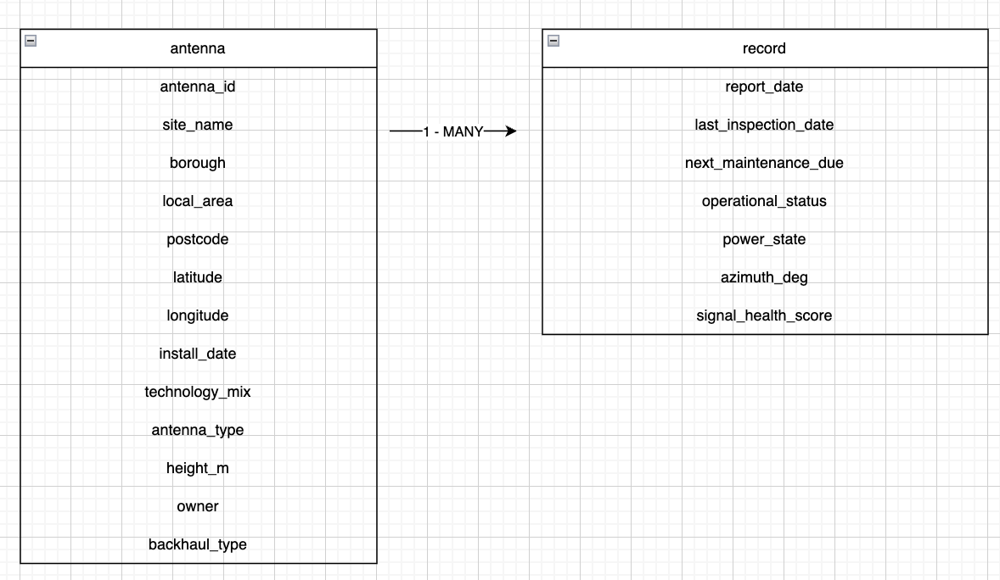
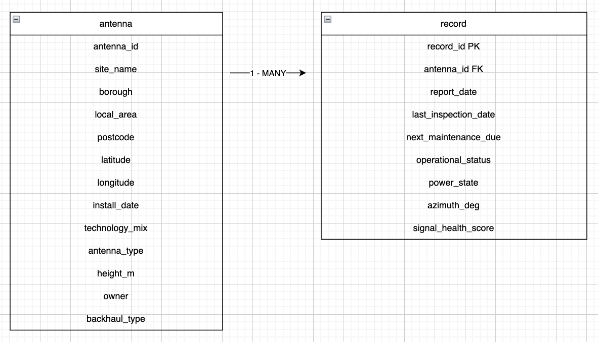
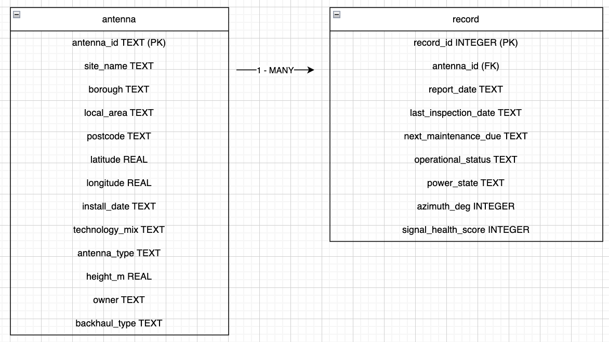

# Workshop Day 8


## Training

Good morning! 

We're nealy done with taking you through Python code, today is going to be one of the last demonstrations we give you and it'll be a little workshop building an application using a lot of the techniques we've covered so far on the course. 

As part of this workshop, I've been presented wtih a brief. 

*"Emile, we receive daily antenna reports as a CSV file and it's taking too long for our team to decide who to assign to perform maintenance on the antennas. We keep information about the signal health and their location, as well as a lot of other antenna details. What I'd like you to do is to start storing the CSV data in DB. The structure is at your discretion, but we'll need to gather a few insights from the data."*

*"We'd like to know the average health of the antennas over their lifespan and also be able to identify specifc antennas based on their ID over different periods of time, whether that's the average health over the last 3 days or week. Most of the time we need information about the worst performing antenna, other times we need data on several"*

*"Additionally, part of the difficulty we have at the moment, is finding the closest enginner to perform maintenence on the antennas. I've attatched a JSON file with our enginners on the books. If possible, we'd like to able able to target specific antennas after querying the database and then assign an engineer to perform maintenance."*

*"Please be adviced though, our engineers can only perform these works in fair weather. When the temperature is above 5 degrees centigrade and the wind is less than 30 miles per hour."*

*"I've attatched the most recent antenna reports to this correspondance"*

*"PS if you can create this application by 12:20 today, that'll be ideal"*


Ok! 

So, this is obviously a made up brief but it includes the need for a DB, consuming both CSV and JSON data and then crunching some data to calculate which antennas are the worst performing. 

There's an element as well regarding the weather as well. 

We know Python doesn't have built in functionality to access the weather over our antennas so it to me, it looks like we may need to use an API to gather the information we need to decide whether it's safe to perform our maintenance work.

## Project structure

Before I do anything I want to think about the best project structure and where to keep individual elements of functionality. 


I know I'm going to need somewhere to store the reports we get from our antenna so let's start just there.

If you're not already on Codespace and would like to code along, let's just head there now. 

I'm going to create a folder called **reports**

- *RUN* `mkdir reports` 

*SHARE ONLY PREVIOUS CSV FILES, NOT TODAYS REPORT*

Then what I'll do is share several CSV reports in the chat. Then I'll drag all of those reports into my **reports folder**

*DRAG CSV FILES INTO /reports**

So that's our raw unprocessed data, maybe each morning we'll receive an email with the latest report. 

Importantly for this workshop, we can see that the naming format is consistent, this will enable us to do some automation further down the line. Most software programs depend on this predictability, whether it's the structure of data received from an API or from files we manually bring into a program. 

As part of my brief I also received a **JSON file** regarding the information about our engineers. 

The stucture would seperate all the different types of data we have available, I want everything to be intuitive and accessible to myself or anyone else. 

- *FROM ./root RUN* `mkdir staff`

*COPY IN JSON FILE TO CHAT*


So write now we have two folders:

1. for our daily CSV reports
2. For our engineer information

So far so good. 

Our first job is to now get all of this data into a DB.

I said this yesterday but regardless of how big a project is, we need to make sure we understand what we're storing in a database and also the relationship between any tables. 

*OPEN ANY CSV FILE*

```csv
antenna_id,site_name,borough,local_area,postcode,latitude,longitude,report_date,install_date,last_inspection_date,next_maintenance_due,operational_status,power_state,technology_mix,antenna_type,height_m,azimuth_deg,owner,backhaul_type,signal_health_score
ANT-LDN-0001,VMO2-CAMDEN-01,Camden,Camden,NW1 3XD,51.540306,-0.148557,2026-03-14,2024-08-03,2025-10-21,2025-11-20,Active,Mains,5G,Panel,14.2,119,VMO2,Fibre,100
ANT-LDN-0002,VMO2-VICTORIA-01,Westminster,Victoria,SW1 1YZ,51.492747,-0.133825,2026-03-14,2018-10-16,2025-11-21,2026-01-20,Active,Backup,4G|5G,Panel,29.6,52,VMO2,Hybrid Fibre/Microwave,86
ANT-LDN-0003,VMO2-ANGEL-01,Islington,Angel,N1 8RD,51.539763,-0.09575,2026-03-14,2021-03-31,2026-02-17,2026-06-17,Active,Mains,4G|5G,Small Cell,13.5,185,VMO2,Fibre,90
ANT-LDN-0004,VMO2-DALSTON-01,Hackney,Dalston,E8 4DM,51.549642,-0.04511,2026-03-14,2020-02-13,2025-11-13,2026-05-12,Active,Mains,3G|4G|5G,Panel,20.2,343,VMO2,Fibre,92
```

The first thing is to understand our data. 

I can see column rows of:
- antenna id
- site name
- borough
- local area
- postcode
- longitude
- latitude
So on and so fourth. 

As I look through these I'm actually doing a few things. 

1. I'm seeing if there's any missing data, which would look like two commas next to each other in a CSV file
2. I'm also looking at if any data is likely repeated across several reports
  - I think that the column for **antenna id** and **site name** will probably appear in multiple of the CSV files and remain the same. 
  - Then column headings like: **singal_health_score** will be more prone to change with each daily report.
  - Practically then I can start to judge this data as existing on two different tables in our DB
  - One table with data for each antenna we have and a secondary table with information regarding the dynamic data which is likely to change with each report
  - I'm thinking a **one to many** database, where one **anetenna** can have many **records** linked to it, avoiding mass duplication of data.
3. The final thing I'm thinking about is the different data types we could store these values as. 
  - We've seen we only receive values from CSV as strings, we'll need to store these more accurately to their SQL data types. 

So I've got some thoughts to go off. 

Let's go ahead and design our ERD to get a better visual representation of the data. 

https://viewer.diagrams.net/

So I want two tables, one for the static antenna information and another for the dynamic data which changes between each report.

I'll create to parent tables:
1. antenna
2. record


Now I neeed to decide which data is going to be consistent between to two. 

If I open up a CSV file

*OPEN ANY CSV* 

What I'll do is create **main.py** and have them both, side by side on my screen.

*CREATE main.py AND OPEN SIDE BY SIDE*

I need to through 1 by 1 and decide whether it's static data and I'll write them down as comments in my **main.py**.

**main.py**
```python
# STATIC
# anetenna_id
# site_name
# borough
# local_area
# postcode
# latitude
# longitude 
# install_date
# technology_mix
# antenna_type
# height_m
# owner
# backhaul_type

# DYNAMIC
# report_date
# last_inspection_date
# next_maintenance_due
# operational_status
# power_state
# azimuth_deg
# signal_health_score
```

This may not be perfect as a non radio enginner but what we should hopefully see is how one record for our static data and link to many rows in our dynamic data.

I just need to add these as my columns on my ERD.



Let's now think about the relationship between the two tables. 

I need a primary key for both. 

On the **antenna** table I think that should be my **antenna_id**, I'll create a **record_id** on the **record** table and I'll also, underneath, add another column for the **antenna_id** which will act as my foreign key to link the two. 



Nice. 

Let's think about the data types, again I'll do this on CodeSpace with my CSV open on the left and my **main.py** open on the right

**main.py**
```python
# TABLE antenna
# antenna_id TEXT (PK)
# site_name TEXT
# borough TEXT
# local_area TEXT
# postcode TEXT
# latitude REAL
# longitude REAL
# install_date TEXT
# technology_mix TEXT
# antenna_type TEXT
# height_m REAL
# owner TEXT
# backhaul_type TEXT

# TABLE record
# record_id INTEGER (PK)
# antenna_id TEXT (FK)
# report_date TEXT
# last_inspection_date TEXT
# next_maintenance_due TEXT
# operational_status TEXT
# power_state TEXT
# azimuth_deg INTEGER
# signal_health_score INTEGER
```

Let's me go and add that to my ERD



At this stage I'd also inspect to see if there was any missing data and then add the keywords NOT NULL. For sake of time I know that all the data is present in each record but if was space for missing data then that column wouldn't have the NOT NULL keyword. 


So now we've got our ERD, we need to convert this into an actual SQL schema. 

I'm going to do this in a new folder which will only relate to the DB.

- *FROM ./root RUN* `mkdir db`
 *INSIDE ./db RUN* `touch schema.sql`

**schema.sql**
```sql
CREATE TABLE IF NOT EXISTS antenna (
    antenna_id TEXT PRIMARY KEY,
    site_name TEXT NOT NULL,
    borough TEXT NOT NULL,
    local_area TEXT NOT NULL,
    postcode TEXT NOT NULL,
    latitude REAL NOT NULL,
    longitude REAL NOT NULL,
    install_date TEXT NOT NULL,
    technology_mix TEXT NOT NULL,
    antenna_type TEXT NOT NULL,
    height_m REAL NOT NULL,
    owner TEXT NOT NULL,
    backhaul_type TEXT NOT NULL
);

CREATE TABLE IF NOT EXISTS record (
    record_id INTEGER PRIMARY KEY AUTOINCREMENT,
    antenna_id TEXT NOT NULL,
    report_date TEXT NOT NULL,
    last_inspection_date TEXT,
    next_maintenance_due TEXT,
    operational_status TEXT NOT NULL,
    power_state TEXT NOT NULL,
    azimuth_deg INTEGER NOT NULL,
    signal_health_score INTEGER NOT NULL,
    FOREIGN KEY (antenna_id) REFERENCES antenna(antenna_id)
);
```

Then at the top of the file, I just need to add some syntax which will acknowledge we're using Foreign Keys

**schema.sql**
```sql
PRAGMA foreign_keys = ON;

CREATE TABLE IF NOT EXISTS antenna (
    antenna_id TEXT PRIMARY KEY,
    site_name TEXT NOT NULL,
    borough TEXT NOT NULL,
    local_area TEXT NOT NULL,
    postcode TEXT NOT NULL,
    latitude REAL NOT NULL,
    longitude REAL NOT NULL,
    install_date TEXT NOT NULL,
    technology_mix TEXT NOT NULL,
    antenna_type TEXT NOT NULL,
    height_m REAL NOT NULL,
    owner TEXT NOT NULL,
    backhaul_type TEXT NOT NULL
);

CREATE TABLE IF NOT EXISTS record (
    record_id INTEGER PRIMARY KEY AUTOINCREMENT,
    antenna_id TEXT NOT NULL,
    report_date TEXT NOT NULL,
    last_inspection_date TEXT,
    next_maintenance_due TEXT,
    operational_status TEXT NOT NULL,
    power_state TEXT NOT NULL,
    azimuth_deg INTEGER NOT NULL,
    signal_health_score INTEGER NOT NULL,
    FOREIGN KEY (antenna_id) REFERENCES antenna(antenna_id)
);
```

Ok, cool.

I'm happy with that, but now I need to add my Python code which will actually create our DB. This will be a function.

I'll create another file inside **db** which will store this.

*FROM ./db RUN* `touch db.py`

**db.py**
```python
import sqlite3

def connect(db_name):
    # creates connection and stores connection functionality to object, held in connection variable
    connection = sqlite3.connect(db_name)
    return connection
```

We've seen it before, that when we call this function, it'll connect to a db, with the name we pass as an argument and if there is no DB, it'll create it. 

I'll head over to **main.py** and try importing and running the function. I don't want to take any large steps without making sure things are working. 

**main.py**
```python
from db.db import connect

connection = connect("app.db")
```

Let's give it a test.

- *RUN* `python main.py`

So I can see a DB has been created. It shouldn't have any data in right now, or any tables. That's defined in our **schema.sql** so I'll create another function which can read and execute that file. 


**main.py**
```python
import sqlite3

def connect(db_name):
    connection = sqlite3.connect(db_name)
    return connection


# NEW CODE
def run_sql_file(conn, filepath):
    with open(filepath, "r", encoding="utf-8") as f:
        sql = f.read()
    conn.executescript(sql)
    conn.commit()
```


So this recieves our connection object and also a file path of SQL to execute.

We open the file, reading its contents and then assign that information to the SQL variable before using the connection to the database to execute the script. 

Let's try it. 

**main.py**
```python
# UPDATED CODE
from db.db import connect, run_sql_file

connection = connect("app.db")
# NEW CODE
run_sql_file(connection, "./db/schema.sql")
```

- *RUN* `python main.py`

There won't be any obvious changes, but I'll go into the DB and inspect for myself.

- *RUN* `sqlite3 app.db`
- *RUN* `.tables`
- *RUN* `SELECT * FROM antenna;`

No information, which is fine. 

So we're nearly at the first part of our brief, we need to now take all this CSV data and input it into our DB. 

There's a little duality to this. 

I want to upload all the previous records but I expect to recieve daily records as well which I'll want to automate as much as possible. 

We haven't recieved a record for today yet so let's focus on the ones we have. 


I'm going to create a new file, I'm going to create it in the DB just because it logically will live with DB actions, reading from a CSV file and uploading it to our database.

- *FROM db RUN* `touch db_utilities.py`

What I need to do is seperate each CSV report into two sections, the information which needs to go into the **antenna** table and then our seperate **record** table. 

Let's do the **antenna** table first.


I'm actually going to write some pseudocode for this

**db_utilities.py**
```python
# Create function which can receive a CSV file name
# Acess to CSV file and covert to Python list
# Loop through list
    # If information already exists for antenna do nothing
    # Otherwise pull out the information relevant for the table
# After loop completes insert records into table
```


Let's actually write some of this out. 

I know how to access a CSV file, something we'd done before. I'll need my CSV import.

I expect to execute this file from **main.py** so when I target a file I'll bear this in mind. 

Fortunately I can see that all our files share a similar pattern, only the date changes, which should make this process a little easier. 

**db_utilities.py**
```python
import csv

def add_antenna(conn, date):
    with open(f"./reports/{date}_antenna_report.csv", "r", encoding="utf-8") as f:
        antennas = list(csv.DictReader(f))

    print(antennas[0])
```


Let's give this a test to see if things are working as expected.

I'll import into **main.py** and see what's happening.

**main.py**
```python
from db.db import connect, run_sql_file
# NEW CODE
from db.db_utilities import add_antenna

connection = connect("app.db")
run_sql_file(connection, "./db/schema.sql")

# NEW CODE
add_antenna(connection, "2026-03-14")
```

- *RUN* `python main.py`

That looks good. 

Now I need to loop through and check if this antenna is already in the DB, if it is, do nothing, otherwise extract the key information.

**db_utilities.py**
```python
import csv

def add_antenna(conn, date):
    with open(f"./reports/{date}_antenna_report.csv", "r", encoding="utf-8") as f:
        antennas = list(csv.DictReader(f))

    # NEW CODE
    new_antennas = []
    # We need to access the cursor to query the db
    cursor = conn.cursor()
    for antenna in antennas:
        cursor.execute("SELECT antenna_id FROM antenna WHERE antenna_id = ?", (antenna["antenna_id"],))
        # If there is data, they'll only be one with that. id
        row = cursor.fetchone()
        if row:
            print("Pre-existing antenna")
        else:
            print("New antennas data")
```

Let's test it

- *RUN* `python main.py`

We should only see new antenna data at the time being. 

Ok, so the next is to extract the information we care about. 

Something we've seen in the schema seed files but we can insert many entries into a DB from a list. The important thing is that every element in that list is a tuple. 

So I'll target our else block and then append the data we care about into our empty list. 

**db_utilities.py**
```python
import csv

def add_antenna(conn, date):
    with open(f"./reports/{date}_antenna_report.csv", "r", encoding="utf-8") as f:
        antennas = list(csv.DictReader(f))

    new_antennas = []
    cursor = conn.cursor()
    for antenna in antennas:
        cursor.execute("SELECT antenna_id FROM antenna WHERE antenna_id = ?", (antenna["antenna_id"],))
        row = cursor.fetchone()
        if row:
            print("Pre-existing antenna")
        else:
            # UPDATED CODE
            new_antennas.append((antenna["antenna_id"], antenna["site_name"], antenna["borough"], antenna["local_area"], antenna["postcode"], float(antenna["latitude"]), float(antenna["longitude"]), antenna["install_date"], antenna["technology_mix"], antenna["antenna_type"], float(antenna["height_m"]), antenna["owner"], antenna["backhaul_type"]))
```

So each element we append is a DB. 

SQLite will actually is pretty good at converting these to the datatypes we see on the schema but I'll give it a little help. 

Once this loop has completed we should have filtered the data for only the information the **antenna** table should hold.

Let's go ahead and insert it. 

**db_utilities.py**
```python
import csv

def add_antenna(conn, date):
    with open(f"./reports/{date}_antenna_report.csv", "r", encoding="utf-8") as f:
        antennas = list(csv.DictReader(f))

    new_antennas = []
    cursor = conn.cursor()
    for antenna in antennas:
        cursor.execute("SELECT antenna_id FROM antenna WHERE antenna_id = ?", (antenna["antenna_id"],))
        row = cursor.fetchone()
        if row:
            print("Pre-existing antenna")
        else:
            new_antennas.append((antenna["antenna_id"], antenna["site_name"], antenna["borough"], antenna["local_area"], antenna["postcode"], float(antenna["latitude"]), float(antenna["longitude"]), antenna["install_date"], antenna["technology_mix"], antenna["antenna_type"], float(antenna["height_m"]), antenna["owner"], antenna["backhaul_type"]))

    # NEW CODE        
    if len(new_antennas) == 0:
        print("No new Antenna location data to add")
    else:
        print("Added new Antenna location data")   
        cursor.executemany("INSERT INTO antenna (antenna_id, site_name, borough, local_area, postcode, latitude, longitude, install_date, technology_mix, antenna_type, height_m, owner, backhaul_type) VALUES (?, ?, ?, ?, ?, ?, ?, ?, ?, ?, ?, ?, ?)", new_antennas)
        conn.commit()
```

Let's give it a test.

- *RUN* `python main.py`

Let's go to our DB and check we've done what we thought.

- *RUN* `sqlite3 app.db`
- *RUN* `.headers on`
- *RUN* `SELECT * FROM antenna;`

That's good. 

Alright, let me change the argument in the function call in **main.py** and see what's that saying.

**main.py**
```python
from db.db import connect, run_sql_file
from db.db_utilities import add_antenna

connection = connect("app.db")
run_sql_file(connection, "./db/schema.sql")

# UPDATED CODE
add_antenna(connection, "2026-03-15")
```

So we now are targetting a new file, but the antenna information should be the same.

- *RUN* `python main.py`

Lovely. Let's remove that print statement so it's a bit cleaner.

**db_utilities.py**
```python
import csv

def add_antenna(conn, date):
    with open(f"./reports/{date}_antenna_report.csv", "r", encoding="utf-8") as f:
        antennas = list(csv.DictReader(f))

    new_antennas = []
    cursor = conn.cursor()
    for antenna in antennas:
        cursor.execute("SELECT antenna_id FROM antenna WHERE antenna_id = ?", (antenna["antenna_id"],))
        row = cursor.fetchone()

        # UPDATED CODE
        if not row:
            new_antennas.append((antenna["antenna_id"], antenna["site_name"], antenna["borough"], antenna["local_area"], antenna["postcode"], float(antenna["latitude"]), float(antenna["longitude"]), antenna["install_date"], antenna["technology_mix"], antenna["antenna_type"], float(antenna["height_m"]), antenna["owner"], antenna["backhaul_type"]))
        
    if len(new_antennas) == 0:
        print("No new Antenna location data to add")
    else:
        print("Added new Antenna location data")   
        cursor.executemany("INSERT INTO antenna (antenna_id, site_name, borough, local_area, postcode, latitude, longitude, install_date, technology_mix, antenna_type, height_m, owner, backhaul_type) VALUES (?, ?, ?, ?, ?, ?, ?, ?, ?, ?, ?, ?, ?)", new_antennas)
        conn.commit()
```

What I should do is test all the files we currently have to see if there's any new data in the backlog of CSV files.

**main.py**
```python
from db.db import connect, run_sql_file
from db.db_utilities import add_antenna

connection = connect("app.db")
run_sql_file(connection, "./db/schema.sql")

# UPDATED CODE
add_antenna(connection, "2026-03-16")
```

- *RUN* `python main.py`

Then for the last file.

**main.py**
```python
from db.db import connect, run_sql_file
from db.db_utilities import add_antenna

connection = connect("app.db")
run_sql_file(connection, "./db/schema.sql")

# UPDATED CODE
add_antenna(connection, "2026-03-17")
```

- *RUN* `python main.py`


I'm probably expecting a new CSV file to arrive into my inbox any moment and I want to basically be able to trigger this file without changing this argument every morning. 

All of this is to save me time. 

What I need is some Python functionality which will basically replace the current date as this argument. 

I won't go through the process of pretend googling and finding out how to but there's an import called **datetime**

**db_utilities.py**
```python
import csv
# NEW CODE
import datetime

# NEW CODE
today = datetime.datetime.now()
today_string = today.strftime("%Y-%m-%d") 

def add_antenna(conn, date):
    with open(f"./reports/{date}_antenna_report.csv", "r", encoding="utf-8") as f:
        antennas = list(csv.DictReader(f))

    new_antennas = []
    cursor = conn.cursor()
    for antenna in antennas:
        cursor.execute("SELECT antenna_id FROM antenna WHERE antenna_id = ?", (antenna["antenna_id"],))
        row = cursor.fetchone()
        if not row:
            new_antennas.append((antenna["antenna_id"], antenna["site_name"], antenna["borough"], antenna["local_area"], antenna["postcode"], float(antenna["latitude"]), float(antenna["longitude"]), antenna["install_date"], antenna["technology_mix"], antenna["antenna_type"], float(antenna["height_m"]), antenna["owner"], antenna["backhaul_type"]))
        
    if len(new_antennas) == 0:
        print("No new Antenna location data to add")
    else:
        print("Added new Antenna location data")   
        cursor.executemany("INSERT INTO antenna (antenna_id, site_name, borough, local_area, postcode, latitude, longitude, install_date, technology_mix, antenna_type, height_m, owner, backhaul_type) VALUES (?, ?, ?, ?, ?, ?, ?, ?, ?, ?, ?, ?, ?)", new_antennas)
        conn.commit()
```

What this does is basically read the current date on the first line, then we format the date into a string on the second. 

I'll import this into **main.py** and pass it as our argument, instead of manually typing it. 

**main.py**
```python
from db.db import connect, run_sql_file
# UPDATED CODE
from db.db_utilities import today_string, add_antenna

connection = connect("app.db")
run_sql_file(connection, "./db/schema.sql")

# UPDATED CODE
add_antenna(connection, today_string)
```

I'm happy with this. I think we also need to now try and write some similar code to add each record. 

I'll keep this in **db_utilities** as well.

It'll be similar in functionality, read from a CSV file using the date and then check if data already exists, if not extract the data we care about. 

The main difference I think is, I'll check if there's already a record with the given date first and block the rest of the function if there is. 

**db_utilities.py**
```python
import csv
import datetime

today = datetime.datetime.now()
today_string = today.strftime("%Y-%m-%d") 

def add_antenna(conn, date):
    with open(f"./reports/{date}_antenna_report.csv", "r", encoding="utf-8") as f:
        antennas = list(csv.DictReader(f))

    new_antennas = []
    cursor = conn.cursor()
    for antenna in antennas:
        cursor.execute("SELECT antenna_id FROM antenna WHERE antenna_id = ?", (antenna["antenna_id"],))
        row = cursor.fetchone()
        if not row:
            new_antennas.append((antenna["antenna_id"], antenna["site_name"], antenna["borough"], antenna["local_area"], antenna["postcode"], float(antenna["latitude"]), float(antenna["longitude"]), antenna["install_date"], antenna["technology_mix"], antenna["antenna_type"], float(antenna["height_m"]), antenna["owner"], antenna["backhaul_type"]))
        
    if len(new_antennas) == 0:
        print("No new Antenna location data to add")
    else:
        print("Added new Antenna location data")   
        cursor.executemany("INSERT INTO antenna (antenna_id, site_name, borough, local_area, postcode, latitude, longitude, install_date, technology_mix, antenna_type, height_m, owner, backhaul_type) VALUES (?, ?, ?, ?, ?, ?, ?, ?, ?, ?, ?, ?, ?)", new_antennas)
        conn.commit()


# NEW CODE
def add_record(conn, date):

    cursor = conn.cursor()   
    cursor.execute("SELECT report_date FROM record WHERE report_date = ?", (date,))
    row = cursor.fetchone()
    
    if row:
        print("Daily log already uploaded")
    else: 
        with open(f"./reports/{date}_antenna_report.csv", "r", encoding="utf-8") as f:
            daily_report = list(csv.DictReader(f))

        new_records = []
        for record in daily_report:
            new_records.append((record["antenna_id"], record["report_date"], record["last_inspection_date"], record["next_maintenance_due"], record["operational_status"], record["power_state"], record["azimuth_deg"], record["signal_health_score"]))

        cursor.executemany("INSERT INTO record (antenna_id, report_date, last_inspection_date, next_maintenance_due, operational_status, power_state, azimuth_deg, signal_health_score) VALUES (?, ?, ?, ?, ?, ?, ?, ?)", new_records)
        print("Daily log data uploaded")
        conn.commit()
```

Let's import and try running it from **main.py**

**main.py**
```python
from db.db import connect, run_sql_file
# UPDATED CODE
from db.db_utilities import today_string, add_antenna, add_record

connection = connect("app.db")
run_sql_file(connection, "./db/schema.sql")

# add_antenna(connection, today_string)

# NEW CODE
add_record(connection, "2026-03-14")
```

If that works, let's just go into our DB to check.

- *RUN* `sqlite3 app.db`
- *RUN* `SELECT * FROM record;`

Ok, now I'll just change the date argument for the 15th, 16th and 17th.

*CHANGE add_record DATE ARGUMENT AND RUN* `python main.py` *AFTER CHANGING*

Once we've done that we can also change the date argument to our dynamic date. 

I'll also uncomment `add_antenna`

**main.py**
```python
from db.db import connect, run_sql_file
from db.db_utilities import today_string, add_antenna, add_record

connection = connect("app.db")
run_sql_file(connection, "./db/schema.sql")

add_antenna(connection, today_string)
# UPDATED CODE
add_record(connection, today_string)
```

It's really good timing because our next report has just arrived in my inbox!

I'll share it with you if you want.

*SHARE TODAYS REPORT*

*DRAG REPORT INTO REPORT FOLDER*

So every time a report comes in, we should be able to just execute **main.py** and have things behave themsevles. 

- *RUN* `python main.py`


## Classes to read DB

Now we need to start building some classes so we can query our db.


It'll be the classes with methods attached which will handle that communication and construct the instance which we can visualise and interpet. 

What I'll do is create a classes and and define two files initially:

1. antenna.py
2. record.py

This match between tables and classes is quite common. There's a table of data and we create a class to handle data coming in from that table.

- *FROM ./root RUN* `mkdir classes`
- *FROM ./classes RUN* `touch antenna.py record.py`

Let's start with just the properties each class should have. 

What I'm going to do is open my schema and for every column, that'll equate to an attribute on the class

**antenna.py**
```python
class Antenna:
    def __init__(self, antenna_id, site_name, borough, local_area, postcode, latitude, longitude, install_date, technology_mix, antenna_type, height_m, owner, backhaul_type):
        self.antenna_id = antenna_id
        self.site_name = site_name
        self.borough = borough
        self.local_area = local_area
        self.postcode = postcode
        self.latitude = latitude
        self.longitude = longitude
        self.install_date = install_date
        self.technology_mix = technology_mix
        self.antenna_type = antenna_type
        self.height_m = height_m
        self.owner = owner
        self.backhaul_type = backhaul_type
```


I'll also do that same for our record class.

**record.py**
```python
class Record:
    def __init__(self, record_id, antenna_id, report_date, last_inspection_date, next_maintenance_due, operational_status, power_state, azimuth_deg, signal_health_scre):
        self.record_id = record_id
        self.antenna_id = antenna_id
        self.report_date = report_date
        self.last_inspection_date = last_inspection_date
        self.next_maintenance_due = next_maintenance_due
        self.operational_status = operational_status
        self.power_state = power_state
        self.azimuth_deg = azimuth_deg
        self.signal_health_score = signal_health_score
```


Now what I need to do is define the **static methods** which can interact with the datebase and pull out the information needed. 

If I remind myself of the brief is requested:

*"We'd like to know the average health of the antennas over their lifespan and also be able to identify specifc antennas based on their ID over different periods of time, whether that's the average health over the last 3 days or week"*


Ok, so a few things there.
- The average health of the antennas over their life span
- Identify specifc antennas based on their ID

To me that looks like a query which is going to target an individual antenna. 

I can do that. 

**antenna.py**
```python
class Antenna:
    def __init__(self, antenna_id, site_name, borough, local_area, postcode, latitude, longitude, install_date, technology_mix, antenna_type, height_m, owner, backhaul_type):
        self.antenna_id = antenna_id
        self.site_name = site_name
        self.borough = borough
        self.local_area = local_area
        self.postcode = postcode
        self.latitude = latitude
        self.longitude = longitude
        self.install_date = install_date
        self.technology_mix = technology_mix
        self.antenna_type = antenna_type
        self.height_m = height_m
        self.owner = owner
        self.backhaul_type = backhaul_type

    # NEW CODE        
    @staticmethod    
    def get_one(conn, antenna_id):        
        cursor = conn.cursor()
        cursor.execute("SELECT * FROM antenna WHERE antenna_id = ?", (antenna_id,))      
        row = cursor.fetchone()

        if row is None:
            return None

        return Antenna(*row)
```


Fairly straight forward, we try and pull a specific antenna from the database and return an instance of it, if we find one. 

Let's test it out.


**main.py**
```python
from db.db import connect, run_sql_file
from db.db_utilities import today_string, add_antenna, add_record
# NEW CODE
from classes.antenna import Antenna

connection = connect("app.db")
run_sql_file(connection, "./db/schema.sql")

add_antenna(connection, today_string)
add_record(connection, today_string)

# NEW CODE
antenna_instance = Antenna.get_one(connection, )
```

So I'll hopefully return an instance to the variable, **antenna_instance**. 

I just need to get an ID to test for function. 

Let me open a CSV file and find one. 

*ONCE CSV FILE OPEN*

I can see the first row holds to antenna id. There's one close to where I like in Tottenham, I saw earlier.

**ANT-LDN-0084**

Let me pass that as a string to my **get one** function.

**main.py**
```python
from db.db import connect, run_sql_file
from db.db_utilities import today_string, add_antenna, add_record
from classes.antenna import Antenna

connection = connect("app.db")
run_sql_file(connection, "./db/schema.sql")

add_antenna(connection, today_string)
add_record(connection, today_string)

# UPDATED CODE
antenna_instance = Antenna.get_one(connection, "ANT-LDN-0084")
# NEW CODE
print(antenna_instance)
```

- *RUN* `python main.py`

Nice!

So what we're seeing is the data and it's location in memory. I'm happy though, it shows we are able to retrieve an Antenna based on its ID.

Annoyingly though it's not giving us any usable data right now. 

What I'd like to do is show you another **dunder method**, we've already got our constructor function or **dunder init** but there's another, called **dunder repr** which is should for representation. 

When we print an instance of a class, if assigned, we'll return the contents of the **dunder repr** function instead of this memory address.


**antenna.py**
```python
class Antenna:
    def __init__(self, antenna_id, site_name, borough, local_area, postcode, latitude, longitude, install_date, technology_mix, antenna_type, height_m, owner, backhaul_type):
        self.antenna_id = antenna_id
        self.site_name = site_name
        self.borough = borough
        self.local_area = local_area
        self.postcode = postcode
        self.latitude = latitude
        self.longitude = longitude
        self.install_date = install_date
        self.technology_mix = technology_mix
        self.antenna_type = antenna_type
        self.height_m = height_m
        self.owner = owner
        self.backhaul_type = backhaul_type

    # NEW CODE    
    def __repr__(self):
        return f"Antenna: {self.antenna_id}, {self.site_name}, {self.borough}, {self.local_area} longitude: {self.longitude}, latitude: {self.latitude}"
        
    @staticmethod    
    def get_one(conn, antenna_id):        
        cursor = conn.cursor()
        cursor.execute("SELECT * FROM antenna WHERE antenna_id = ?", (antenna_id,))      
        row = cursor.fetchone()

        if row is None:
            return None

        return Antenna(*row)
```


Let's execute our main file again. 

- *RUN* `python main.py`

A much nicer representation of the instance. 

That maybe all I need in the antenna class. 

What they wanted was the ability to find the average health scores and then to find the average health scores of a specific period of time.

I'm going to try and bundle this into one method. 

We've been learning about default values and other ways to alter function behaviour. I think there's a way.

**record.py**
```python
class Record:
    def __init__(self, record_id, antenna_id, report_date, last_inspection_date, next_maintenance_due, operational_status, power_state, azimuth_deg, signal_health_scre):
        self.record_id = record_id
        self.antenna_id = antenna_id
        self.report_date = report_date
        self.last_inspection_date = last_inspection_date
        self.next_maintenance_due = next_maintenance_due
        self.operational_status = operational_status
        self.power_state = power_state
        self.azimuth_deg = azimuth_deg
        self.signal_health_score = self.signal_health_score


    @staticmethod
    def lowest_average_signal_health(conn):
```

Now the work begins. 

What's the broadest query I can make which aligns with the objective of the function.

I think that's returning all rows of our records and ordering that information by the average health score.

That I can do.


**record.py**
```python
class Record:
    def __init__(self, record_id, antenna_id, report_date, last_inspection_date, next_maintenance_due, operational_status, power_state, azimuth_deg, signal_health_scre):
        self.record_id = record_id
        self.antenna_id = antenna_id
        self.report_date = report_date
        self.last_inspection_date = last_inspection_date
        self.next_maintenance_due = next_maintenance_due
        self.operational_status = operational_status
        self.power_state = power_state
        self.azimuth_deg = azimuth_deg
        self.signal_health_score = self.signal_health_score


    @staticmethod
    def lowest_average_signal_health(conn):
        cursor = conn.cursor()
        cursor.execute(
            """
            SELECT antenna_id, AVG(signal_health_score)
            FROM record
            GROUP BY antenna_id
            ORDER BY AVG(signal_health_score) ASC
            """
        )
        
        return cursor.fetchall()
```

So we group our data by the different antennas which we know will be duplicated in each CSV file, then from those groups we aggregate the average **signal_health_score** and order it from lowest to best.

We don't have a property on the Record class for average health so I'm going to test this just with the raw data.

I'll import into main.py and test it. 

**main.py**
```python
from db.db import connect, run_sql_file
from db.db_utilities import today_string, add_antenna, add_record
from classes.antenna import Antenna
from classes.record import Record

connection = connect("app.db")
run_sql_file(connection, "./db/schema.sql")

add_antenna(connection, today_string)
add_record(connection, today_string)

# antenna_instance = Antenna.get_one(connection, "ANT-LDN-0084")
# print(antenna_instance)

records = Record.lowest_average_signal_health(connection)
print(records)
```

- *RUN* `python main.py`

This would be part of the brief complete.

The brief also wanted some dynamism about the information we retrieve, whether we return the worst performing antenna or several. 

I think I can refactor our code to accomodate that. 


**record.py**
```python
class Record:
    def __init__(self, record_id, antenna_id, report_date, last_inspection_date, next_maintenance_due, operational_status, power_state, azimuth_deg, signal_health_scre):
        self.record_id = record_id
        self.antenna_id = antenna_id
        self.report_date = report_date
        self.last_inspection_date = last_inspection_date
        self.next_maintenance_due = next_maintenance_due
        self.operational_status = operational_status
        self.power_state = power_state
        self.azimuth_deg = azimuth_deg
        self.signal_health_score = self.signal_health_score


    @staticmethod
    # UPDATED CODE
    def lowest_average_signal_health(conn, limit = None):
        cursor = conn.cursor()
        cursor.execute(
            """
            SELECT antenna_id, AVG(signal_health_score)
            FROM record
            GROUP BY antenna_id
            ORDER BY AVG(signal_health_score) ASC
            # NEW CODE 
            LIMIT ?
            """,
            (limit, )
        )
        
        return cursor.fetchall()
```

What I've done is pass in a new parameter with a default value. 

I want some logic that will give the limit as the full dataset when nothing is passed in and then also be dynamic enough that we can also target a specific limit.

We've seen how we can count the number of antennas in our database.

**record.py**
```python
class Record:
    def __init__(self, record_id, antenna_id, report_date, last_inspection_date, next_maintenance_due, operational_status, power_state, azimuth_deg, signal_health_scre):
        self.record_id = record_id
        self.antenna_id = antenna_id
        self.report_date = report_date
        self.last_inspection_date = last_inspection_date
        self.next_maintenance_due = next_maintenance_due
        self.operational_status = operational_status
        self.power_state = power_state
        self.azimuth_deg = azimuth_deg
        self.signal_health_score = self.signal_health_score


    @staticmethod
    def lowest_average_signal_health(conn, limit = None):
        cursor = conn.cursor()
        
        # NEW CODE
        if limit is None:
            cursor.execute("SELECT COUNT(*) FROM antenna")
            limit = cursor.fetchone()
            print("LOOK HERE",limit)
        
        cursor.execute(
            """
            SELECT antenna_id, AVG(signal_health_score)
            FROM record
            GROUP BY antenna_id
            ORDER BY AVG(signal_health_score) ASC
            LIMIT ?
            """,
            (limit, )
        )
        
        return cursor.fetchall()
```

It won't work yet but let's give it a test.


Let me just comment out our records for a cleaner output. 

I expect this to give us an error right now. 

**main.py**
```python
from db.db import connect, run_sql_file
from db.db_utilities import today_string, add_antenna, add_record
from classes.antenna import Antenna
from classes.record import Record

connection = connect("app.db")
run_sql_file(connection, "./db/schema.sql")

add_antenna(connection, today_string)
add_record(connection, today_string)

# antenna_instance = Antenna.get_one(connection, "ANT-LDN-0084")
# print(antenna_instance)

records = Record.lowest_average_signal_health(connection)
# print(records)
```

- *RUN* `python main.py`

If I scroll to the top, we can see that the limit value is returned as a tuple, with one element inside. 

The value is 500 which is good, we've seen we have 500 antennas in our DB. 

We also know, we can access the first element in a tuple using square bracket notation, what'll it'll do then is, if there's no value passed as the argument for limit, we'll always return the whole data set. 


**record.py**
```python
class Record:
    def __init__(self, record_id, antenna_id, report_date, last_inspection_date, next_maintenance_due, operational_status, power_state, azimuth_deg, signal_health_scre):
        self.record_id = record_id
        self.antenna_id = antenna_id
        self.report_date = report_date
        self.last_inspection_date = last_inspection_date
        self.next_maintenance_due = next_maintenance_due
        self.operational_status = operational_status
        self.power_state = power_state
        self.azimuth_deg = azimuth_deg
        self.signal_health_score = self.signal_health_score


    @staticmethod
    def lowest_average_signal_health(conn, limit = None):
        cursor = conn.cursor()
        
        if limit is None:
            cursor.execute("SELECT COUNT(*) FROM antenna")
            # UPDATED CODE
            limit = cursor.fetchone()[0]
        
        cursor.execute(
            """
            SELECT antenna_id, AVG(signal_health_score)
            FROM record
            GROUP BY antenna_id
            ORDER BY AVG(signal_health_score) ASC
            LIMIT ?
            """,
            (limit, )
        )
        
        return cursor.fetchall()
```

Hopefully this should work. 

**main.py**
```python
from db.db import connect, run_sql_file
from db.db_utilities import today_string, add_antenna, add_record
from classes.antenna import Antenna
from classes.record import Record

connection = connect("app.db")
run_sql_file(connection, "./db/schema.sql")

add_antenna(connection, today_string)
add_record(connection, today_string)

# antenna_instance = Antenna.get_one(connection, "ANT-LDN-0084")
# print(antenna_instance)

# UPDATED CODE
records = Record.lowest_average_signal_health(connection, 5)
print(records)
```

- *RUN* `python main.py`

The 5 worst performing antennas


**main.py**
```python
from db.db import connect, run_sql_file
from db.db_utilities import today_string, add_antenna, add_record
from classes.antenna import Antenna
from classes.record import Record

connection = connect("app.db")
run_sql_file(connection, "./db/schema.sql")

add_antenna(connection, today_string)
add_record(connection, today_string)

# antenna_instance = Antenna.get_one(connection, "ANT-LDN-0084")
# print(antenna_instance)

# UPDATED CODE
records = Record.lowest_average_signal_health(connection, 50)
print(records)
```

- *RUN* `python main.py`

The 50 worst performing antennas


**main.py**
```python
from db.db import connect, run_sql_file
from db.db_utilities import today_string, add_antenna, add_record
from classes.antenna import Antenna
from classes.record import Record

connection = connect("app.db")
run_sql_file(connection, "./db/schema.sql")

add_antenna(connection, today_string)
add_record(connection, today_string)

# antenna_instance = Antenna.get_one(connection, "ANT-LDN-0084")
# print(antenna_instance)

# UPDATED CODE
records = Record.lowest_average_signal_health(connection)
print(records)
```

- *RUN* `python main.py`

All the worst performing antennas is order. 

I love this function. 

We're nearly there, the final thing I want to do is allow the user to call the function to return a specific period. We may want to see the average health score over 1 days, or since our records began.

Fortunately SQL has a built in date function which usually takes one or two arguments. 

1. The 1st is a date
2. The second is a modifier, if we choose to pass it

What this is going to help me do is stipulate a range of dates to make our assessment from.

I'll also pass in some control flow to handle whether we recieve a value or not. 

The default behaviour will be all dates, unless we're told otherwise. 

**record.py**
```python
class Record:
    def __init__(self, record_id, antenna_id, report_date, last_inspection_date, next_maintenance_due, operational_status, power_state, azimuth_deg, signal_health_scre):
        self.record_id = record_id
        self.antenna_id = antenna_id
        self.report_date = report_date
        self.last_inspection_date = last_inspection_date
        self.next_maintenance_due = next_maintenance_due
        self.operational_status = operational_status
        self.power_state = power_state
        self.azimuth_deg = azimuth_deg
        self.signal_health_score = self.signal_health_score


    @staticmethod
    # UPFATED CODE
    def lowest_average_signal_health(conn, limit = None, period= None):
        cursor = conn.cursor()
        
        if limit is None:
            cursor.execute("SELECT COUNT(*) FROM antenna")
            limit = cursor.fetchone()[0]
        
        # NEW CODE
        if period is None:
            cursor.execute(
                """
                SELECT antenna_id, AVG(signal_health_score)
                FROM record
                GROUP BY antenna_id
                ORDER BY AVG(signal_health_score) ASC
                LIMIT ?
                """,
                (limit, )
            )
        
        return cursor.fetchall()
```

So if no information about the time period is give, we run the request as normal.

The magic will happen in our else block. 

**record.py**
```python
class Record:
    def __init__(self, record_id, antenna_id, report_date, last_inspection_date, next_maintenance_due, operational_status, power_state, azimuth_deg, signal_health_scre):
        self.record_id = record_id
        self.antenna_id = antenna_id
        self.report_date = report_date
        self.last_inspection_date = last_inspection_date
        self.next_maintenance_due = next_maintenance_due
        self.operational_status = operational_status
        self.power_state = power_state
        self.azimuth_deg = azimuth_deg
        self.signal_health_score = self.signal_health_score


    @staticmethod
    def lowest_average_signal_health(conn, limit = None, period= None):
        cursor = conn.cursor()
        
        if limit is None:
            cursor.execute("SELECT COUNT(*) FROM antenna")
            limit = cursor.fetchone()[0]
        
        if period is None:
            cursor.execute(
                """
                SELECT antenna_id, AVG(signal_health_score)
                FROM record
                GROUP BY antenna_id
                ORDER BY AVG(signal_health_score) ASC
                LIMIT ?
                """,
                (limit, )
            )
        else:
            """
            SELECT antenna_id, AVG(signal_health_score)
            FROM record
            WHERE
            """
        
        return cursor.fetchall()
```

WHERE what?

If I pass in the value 2, what I want is to pull in the averages over the last two days

Ideally I can use SQLite to work out what the date was two days ago, i.e. 16th March and then, only consider records with a date value greater than that. 

**record.py**
```python
class Record:
    def __init__(self, record_id, antenna_id, report_date, last_inspection_date, next_maintenance_due, operational_status, power_state, azimuth_deg, signal_health_scre):
        self.record_id = record_id
        self.antenna_id = antenna_id
        self.report_date = report_date
        self.last_inspection_date = last_inspection_date
        self.next_maintenance_due = next_maintenance_due
        self.operational_status = operational_status
        self.power_state = power_state
        self.azimuth_deg = azimuth_deg
        self.signal_health_score = self.signal_health_score


    @staticmethod
    def lowest_average_signal_health(conn, limit = None, period= None):
        cursor = conn.cursor()
        
        if limit is None:
            cursor.execute("SELECT COUNT(*) FROM antenna")
            limit = cursor.fetchone()[0]
        
        if period is None:
            cursor.execute(
                """
                SELECT antenna_id, AVG(signal_health_score)
                FROM record
                GROUP BY antenna_id
                ORDER BY AVG(signal_health_score) ASC
                LIMIT ?
                """,
                (limit, )
            )
        else:
            cursor.execute(
                """
                SELECT antenna_id, AVG(signal_health_score)
                FROM record
                WHERE date(report_date) > date('now', ?)
                """
            )
        
        return cursor.fetchall()
```

Again, I really like this code.

If we receive a value on the period parameter. 

We execute our else block and only consider records where the value of the **report date** is greater than what **date('now', ?)** resolves as. 

It'll make sense once we complete the query but **date('now', ?)** calcualtes a date. 

The first argument is now. i.e. the 18th March and then if we pass in as the second argument, **-2 days**, the entire **date('now', -2 days)** to resolve as the date 2 days ago. 

Then we can intepret this entire line as, filter the records, and only keep the records whhere the report date is greater than the date two days ago. 


**record.py**
```python
class Record:
    def __init__(self, record_id, antenna_id, report_date, last_inspection_date, next_maintenance_due, operational_status, power_state, azimuth_deg, signal_health_scre):
        self.record_id = record_id
        self.antenna_id = antenna_id
        self.report_date = report_date
        self.last_inspection_date = last_inspection_date
        self.next_maintenance_due = next_maintenance_due
        self.operational_status = operational_status
        self.power_state = power_state
        self.azimuth_deg = azimuth_deg
        self.signal_health_score = self.signal_health_score


    @staticmethod
    def lowest_average_signal_health(conn, limit = None, period= None):
        cursor = conn.cursor()
        
        if limit is None:
            cursor.execute("SELECT COUNT(*) FROM antenna")
            limit = cursor.fetchone()[0]
        
        if period is None:
            cursor.execute(
                """
                SELECT antenna_id, AVG(signal_health_score)
                FROM record
                GROUP BY antenna_id
                ORDER BY AVG(signal_health_score) ASC
                LIMIT ?
                """,
                (limit, )
            )
        else:
            cursor.execute(
                """
                SELECT antenna_id, AVG(signal_health_score)
                FROM record
                WHERE date(report_date) >= date('now', ?)
            -->    WHERE date(report_date) > date('now', -2 days)
            -->    WHERE date(report_date) > 2026-03-16
                """
            )

        return cursor.fetchall()
```


*REMOVE CHANGES*

Let's finish off this query.

**record.py**
```python
class Record:
    def __init__(self, record_id, antenna_id, report_date, last_inspection_date, next_maintenance_due, operational_status, power_state, azimuth_deg, signal_health_scre):
        self.record_id = record_id
        self.antenna_id = antenna_id
        self.report_date = report_date
        self.last_inspection_date = last_inspection_date
        self.next_maintenance_due = next_maintenance_due
        self.operational_status = operational_status
        self.power_state = power_state
        self.azimuth_deg = azimuth_deg
        self.signal_health_score = self.signal_health_score


    @staticmethod
    def lowest_average_signal_health(conn, limit = None, period= None):
        cursor = conn.cursor()
        
        if limit is None:
            cursor.execute("SELECT COUNT(*) FROM antenna")
            limit = cursor.fetchone()[0]
        
        if period is None:
            cursor.execute(
                """
                SELECT antenna_id, ROUND(AVG(signal_health_score),2)
                FROM record
                GROUP BY antenna_id
                ORDER BY AVG(signal_health_score) ASC
                LIMIT ?
                """,
                (limit, )
            )
        else:
            cursor.execute(
                """
                SELECT antenna_id, ROUND(AVG(signal_health_score),2)
                FROM record
                WHERE date(report_date) >= date('now', ?)
                GROUP BY antenna_id
                ORDER BY AVG(signal_health_score) ASC
                LIMIT ?
                """,
                (f"-{period-1} days", limit)
            )
        return cursor.fetchall()
```

Let's play around with it. 

**main.py**
```python
from db.db import connect, run_sql_file
from db.db_utilities import today_string, add_antenna, add_record
from classes.antenna import Antenna
from classes.record import Record

connection = connect("app.db")
run_sql_file(connection, "./db/schema.sql")

add_antenna(connection, today_string)
add_record(connection, today_string)

# antenna_instance = Antenna.get_one(connection, "ANT-LDN-0084")
# print(antenna_instance)

records = Record.lowest_average_signal_health(connection)
print(records)
```

Average health since records began

- *RNN `python main.py`


**main.py**
```python
from db.db import connect, run_sql_file
from db.db_utilities import today_string, add_antenna, add_record
from classes.antenna import Antenna
from classes.record import Record

connection = connect("app.db")
run_sql_file(connection, "./db/schema.sql")

add_antenna(connection, today_string)
add_record(connection, today_string)

# antenna_instance = Antenna.get_one(connection, "ANT-LDN-0084")
# print(antenna_instance)

records = Record.lowest_average_signal_health(connection, 10, 2)
print(records)
```

10 worst performing antennas over last 2 days


- *RUN* `python main.py`

**main.py**
```python
from db.db import connect, run_sql_file
from db.db_utilities import today_string, add_antenna, add_record
from classes.antenna import Antenna
from classes.record import Record

connection = connect("app.db")
run_sql_file(connection, "./db/schema.sql")

add_antenna(connection, today_string)
add_record(connection, today_string)

# antenna_instance = Antenna.get_one(connection, "ANT-LDN-0084")
# print(antenna_instance)

records = Record.lowest_average_signal_health(connection, 10, 4)
print(records)
```

10 worst performing antennas over last 4 days


- *RUN* `python main.py`


**main.py**
```python
from db.db import connect, run_sql_file
from db.db_utilities import today_string, add_antenna, add_record
from classes.antenna import Antenna
from classes.record import Record

connection = connect("app.db")
run_sql_file(connection, "./db/schema.sql")

add_antenna(connection, today_string)
add_record(connection, today_string)

# antenna_instance = Antenna.get_one(connection, "ANT-LDN-0084")
# print(antenna_instance)

records = Record.lowest_average_signal_health(connection, 1, 1)
print(records)
```

Worst performing antenna today


- *RUN* `python main.py`


We're inching closer. 

In our output, we can see it's a tuple, inside a list. 

Our ID is the first value, I'm going to extract that value and then use it in our Antenna's **get one** method.


**main.py**
```python
from db.db import connect, run_sql_file
from db.db_utilities import today_string, add_antenna, add_record
from classes.antenna import Antenna
from classes.record import Record

connection = connect("app.db")
run_sql_file(connection, "./db/schema.sql")

add_antenna(connection, today_string)
add_record(connection, today_string)


records = Record.lowest_average_signal_health(connection, 1, 1)
# NEW CODE
antenna = Antenna.get_one(connection, records[0][0])

# NEW CODE
print(antenna)
```

- *RUN* `python main.py`

It looks like we've found our worst performing Antenna today. 

We need to try and now find our closest engineer so see if they can do an inspection. 

We've seen we have a JSON file with information about all our London based engineers. We could see if there's a match in the location of the antenna and the enginner but there's a relatively easy formula we can use based on the longitude and latitude. 


The first thing I'm going to do is seperate my logic into a new file/

- *FROM ./root RUN* `touch assign_job.py`

There's a few things I'm going to initially need to do. 

I want a function which will read from my engineers.json file and also recieve a instance of an antenna. 

**assign_job.py**
```python
import json

def find_closest_engineer(antenna):
    
    antenna_longitude = antenna.longitude
    antenna_latitude = antenna.latitude
    
    with open("./staff/engineers.json", "r", encoding="utf-8") as f:
        engineers = json.load(f)
```

So this function recieves an instance of an antenna as an argument and we extract the values held on the longitude and the latitude. 

We also will need to pull in the data about our engineers and we store that to a variable, engineers. 

I didn't know before hand but calculating the distance between two coordinates is relatively simple.

**assign_job.py**
```python
import json

def find_closest_engineer(antenna):
    
    antenna_longitude = antenna.longitude
    antenna_latitude = antenna.latitude
    
    with open("./staff/engineers.json", "r", encoding="utf-8")as f:
        engineers = json.load(f)

    # NEW CODE    
    closest_engineer = None
    closest_distance = float("inf")
```

So we don't have a value for cloest enginner and **closest_distance**, we've not seen before but `inf` represents infinity. 

We're going to loop through our data and essentially, we'll compare the distance from each enginner compared to our antenna but we need to find the closest, so our starting point is basically the maximum distance away. 

I should say, this wasn't something I had used before. I decided to loop through my engineers and as first I put closest disntance as 10 thousand, which I thought looks awful and doesn't mean anything, so I googled if there was a representation of a high number and it returned this syntax to me. 

Anyway, let's loop through our enginners and see if any are closer than infinite light years away. 


**assign_job.py**
```python
import json

def find_closest_engineer(antenna):
    
    antenna_longitude = antenna.longitude
    antenna_latitude = antenna.latitude
    
    with open("./staff/engineers.json", "r", encoding="utf-8")as f:
        engineers = json.load(f)
        
    closest_engineer = None
    closest_distance = float("inf")

    # NEW CODE    
    for engineer in engineers:
        distance_x = engineer["longitude"] - antenna_longitude
        distance_y = engineer["latitude"] - antenna_latitude
        distance = distance_x**2 + distance_y **2
```

So that's how we calculate the distance based on longitude and latitude. 

Now I need some control flow. 

**assign_job.py**
```python
import json

def find_closest_engineer(antenna):
    
    antenna_longitude = antenna.longitude
    antenna_latitude = antenna.latitude
    
    with open("./staff/engineers.json", "r", encoding="utf-8")as f:
        engineers = json.load(f)
        
    closest_engineer = None
    closest_distance = float("inf")
    
    for engineer in engineers:
        distance_x = engineer["longitude"] - antenna_longitude
        distance_y = engineer["latitude"] - antenna_latitude
        distance = distance_x**2 + distance_y **2
        
        if distance < closest_distance:
            closest_distance = distance
            closest_engineer = engineer
    
    return closest_engineer
```

Let's test this function.


**main.py**
```python
from db.db import connect, run_sql_file
from db.db_utilities import today_string, add_antenna, add_record
from classes.antenna import Antenna
from classes.record import Record
# NEW CODE
from assign_job import find_closest_engineer

connection = connect("app.db")
run_sql_file(connection, "./db/schema.sql")

add_antenna(connection, today_string)
add_record(connection, today_string)

records = Record.lowest_average_signal_health(connection, 1, 1)
antenna = Antenna.get_one(connection, records[0][0])

# NEW CODE
engineer = find_closest_engineer(antenna)
print(antenna)
print(engineer)
```

We should be seeing the worst performing antenna and also the closest enginner. 

There's lots of keys on the engineer dictionary and we could add in logic as like, i.e. they have to be on call etc.. or have more than 2 years experience. 

For me though, the final part of this is checking if the weather is good enough to send our engineer out on the job to perform maintenance. 

I'll do from a function and as I said at the top of the day, Python doesn't know about the weather so I'm going to use an API.

I'll start off with trying to see how the API behaves on postman.

*OPEN POSTMAN*

- Leeds Weather: `https://api.open-meteo.com/v1/forecast?latitude=53.8008&longitude=-1.5500&current_weather=true`
- Glasgow Weather: `https://api.open-meteo.com/v1/forecast?latitude=55.8617&longitude=-4.2583&current_weather=true`

*TEST*

Hopefully, you can see where I'm going to take this. 

I need to replace the latitude and logitude information with the data regarding our antennas and check the weather is permissable. 

**assign_job.py**
```python
import json
# NEW CODE
import requests

def find_closest_engineer(antenna):
    
    antenna_longitude = antenna.longitude
    antenna_latitude = antenna.latitude
    
    with open("./staff/engineers.json", "r", encoding="utf-8")as f:
        engineers = json.load(f)
        
    closest_engineer = None
    closest_distance = float("inf")
    
    for engineer in engineers:
        distance_x = engineer["longitude"] - antenna_longitude
        distance_y = engineer["latitude"] - antenna_latitude
        distance = distance_x**2 + distance_y **2
        
        if distance < closest_distance:
            closest_distance = distance
            closest_engineer = engineer
    
    return closest_engineer


# NEW CODE
def fetch_weather(antenna):
    antenna_longitude = antenna.longitude
    antenna_latitude = antenna.latitude
    
    response = requests.get(f"https://api.open-meteo.com/v1/forecast?latitude={antenna_latitude}&longitude={antenna_longitude}&current_weather=true")
    if response.status_code == 200:
        data = response.json()
        weather = {
            "temp_c": data["current_weather"]["temperature"],
            "windspeed": data["current_weather"]["windspeed"]
        }
        return weather
    else:
        return "Unable to retrieve weather"
```

Let's wrap this up by consuming this in **main.py**


**main.py**
```python
from db.db import connect, run_sql_file
from db.db_utilities import today_string, add_antenna, add_record
from classes.antenna import Antenna
from classes.record import Record
# UPDATED CODE
from assign_job import find_closest_engineer, fetch_weather

connection = connect("app.db")
run_sql_file(connection, "./db/schema.sql")

add_antenna(connection, today_string)
add_record(connection, today_string)

records = Record.lowest_average_signal_health(connection, 1, 1)
antenna = Antenna.get_one(connection, records[0][0])


engineer = find_closest_engineer(antenna)
# NEW CODE
weather = fetch_weather(antenna)

# NEW CODE
if weather["temp_c"] >= 5 and weather["windspeed"] <= 30:
    print(f"{engineer["name"]} is the closest engineer able to work at the {antenna.site_name} in {antenna.local_area}")
```


- *RUN* `python main.py`

That's the demo I wanted to show you. We could if we wished take this much further and continue adding functionality.

Next week you're going to have the opportunity to try and build a software application similar in nature. One which hopefully relates directly to your work. 

I'm going to stop talking but what I'll do is share this project with you so you can explore it. 


# Possible Virtual Environment

- `python3 -m venv venv`
- `source venv/bin/activate`
- `pip install requests`

## Leaving
- `deactivate`
